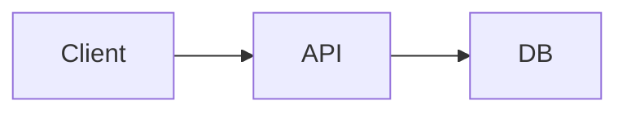

[[Descriptive/Mermaid (DSL)]] [[Terraform/variable file]] [[Nginx/Configuration]] [[Architectures/Orchestration layer]]

# DSL (Domain Specific Language)

> Language tuned to one problem domain — expressive for experts, useless elsewhere — **contrast with general-purpose languages**.

## Mental model

A **DSL** trades generality for **domain fit**: SQL for relations, Regex for strings, HCL for infra, CSS for styling, Mermaid for diagrams.

```
General-purpose (Java, Python)     DSL (SQL, Makefile, GraphQL schema)
        │                                    │
   Turing-complete, broad              Narrow vocabulary, high signal
   more boilerplate                    wrong tool outside domain
```

| Type | Example | Hosted in |
|------|---------|-----------|
| **External DSL** | SQL, Regex | Own parser |
| **Internal DSL** | Fluent API in Ruby | Host language syntax |
| **Declarative config** | [[Terraform/variable file]] HCL, K8s YAML | Engine interprets |

## Standard config / commands

### When to introduce a DSL

```text
☐ Domain rules repeat across code (policy, routing, workflow)
☐ Non-dev stakeholders must edit safely (ops, analysts)
☐ Errors should be domain-specific ("invalid CIDR" not stack trace)
☐ Alternative is 500-line if/else — DSL + interpreter cleaner
```

### External DSL example — policy (conceptual)

```rego
# Open Policy Agent — Rego DSL
allow {
  input.user.role == "admin"
}
```

### Internal DSL — builder pattern

```javascript
const query = db.select('id', 'name')
  .from('users')
  .where('active', true)
  .limit(10);
```

### Infra DSL — Terraform HCL

```hcl
resource "aws_instance" "web" {
  ami           = var.ami_id
  instance_type = "t3.micro"
  tags = { Env = var.environment }
}
```

### Diagram DSL — Mermaid (this vault)



See [[Descriptive/Mermaid (DSL)]].

### Anti-pattern — accidental DSL

```javascript
// Stringly "DSL" in JSON without schema validation
{ "action": "doThing", "arg": 1 }  // prefer protobuf/OpenAPI/JSON Schema
```

## Triage (when things break)

| Symptom | Check | Fix |
|---------|-------|-----|
| Users hate syntax | Wrong abstraction level | Narrow vocabulary; better errors |
| DSL bugs opaque | No source locations in errors | ANTLR/pest with line numbers |
| Security hole in interpreter | Turing-complete user scripts | Sandbox; cap loops; no file IO |
| Two DSLs for same domain | Org drift | Consolidate; version schema |
| Hard to test | No golden files | Snapshot parse → AST → eval |

## Gotchas

> [!WARNING]
> **Every DSL becomes a maintenance product** — parsers, docs, migration, IDE support.

- **YAML as DSL** — easy to start, painful at scale (no types, footgun syntax).
- **Internal DSL** inherits host complexity — Ruby DSL unreadable to non-Ruby devs.
- **Version DSL files** in git — breaking grammar needs migration tool.

## When NOT to use

- One-off 10-line config — JSON/YAML enough.
- Team lacks parser expertise and domain rules change weekly — use data-driven tables in code.

## Related

[[Descriptive/Mermaid (DSL)]] [[Terraform/variable file]] [[Nginx/Configuration]] [[Architectures/Orchestration layer]]
