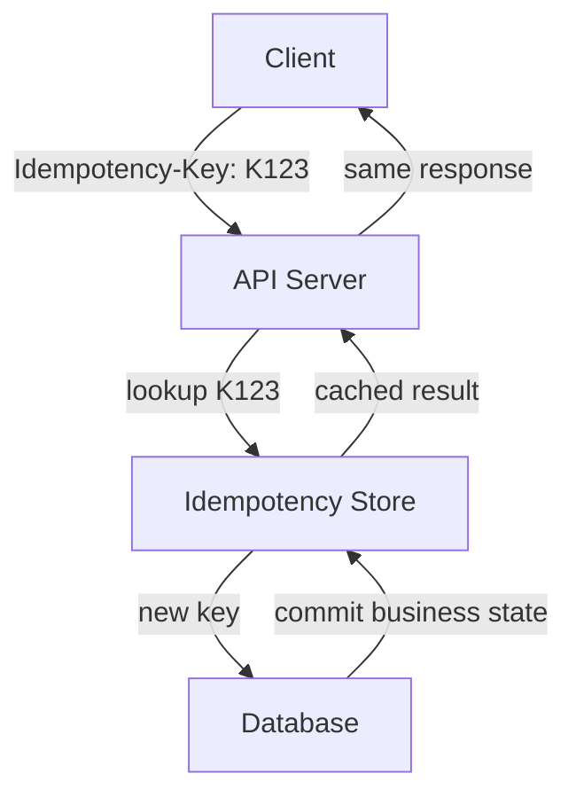
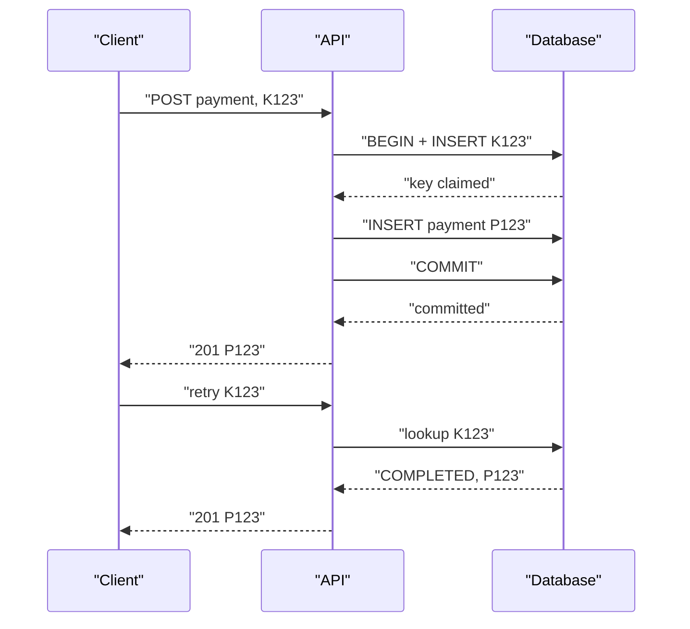

An **Idempotent-key** is a unique identifier you attach to an API request so that the server can safely recognize retries of the **same operation** and avoid performing it more than once.
- you also need to validate the request associated with the key. A key should not be reusable for a different operation:
```txt
K123 + amount=1000 -> P123
K123 + amount=5000  -> ERROR
```

**Problem it solves**
A client sends `POST /orders` to create a resource. The request succeeds server-side, but the response is lost (network drop, timeout). The client retries the same POST. Without protection, this creates a second, duplicate resource — a data integrity violation.

"What matters is that the key is generated **before the operation is sent and remains stable for the logical operation's retires.**"

> [!NOTE]
> The key must be client-generated per logical operation, not server-generated, since the whole point is that the client can safely resend the same key across retries of the same logical request.
- the key idea is that the **client owns the identity of the logical operation.**

> [!NOTE]
> If the **server generate the key,** the client wouldn't know which key to reuse when retrying the request that timed out. It would effectively be creating a new operation on every retry.


## Mechanism


1. Client generates a unique key (typically a UUID) per logical operation and sends it in a header, e.g.:

```
POST /orders
Idempotency-Key: 7c9e6679-7425-40de-944b-e07fc1f90ae7
```

```sql
CREATE TABLE idempotency_keys (
  key             UUID PRIMARY KEY,
  request_hash    TEXT NOT NULL,      -- hash of request body, detects key reuse with different payload
  status          TEXT NOT NULL,      -- 'processing' | 'completed' | 'failed'
  response_body   JSONB,
  response_status INT,
  created_at      TIMESTAMPTZ DEFAULT now(),
  expires_at      TIMESTAMPTZ         -- TTL, e.g. 24h
);
```

The server first checks the **idempotency store**.
It then **atomically** claims the key and performs the business operation. After successful commit, it stores something conceptually like:

```txt
idempotency_key = K123
request_hash    = SHA256(request body)
status          = COMPLETED
response_code   = 201
response_body   = {"paymentId": "P123"}
expires_at      = ...
```
**The important part is that `key check` and `claim` cannot be two independent operations** Two API servers can concurrently execute. The idempotency store therefore needs an atomic uniqueness constraint

```sql
CREATE UNIQUE INDEX idx_idempotency_key
ON idempotency_keys(idempotency_key);
```

For database-backed implementation, the strongest design is to put the idempotency record and business mutation in the same database transaction:

```sql
BEGIN

INSERT INTO idempotency_keys(key, request_hash, status)
VALUES ('K123', H, 'PROCESSING');

INSERT INTO payments(...);

UPDATE idempotency_keys
SET status = 'COMPLETED',
    response = ...
WHERE key = 'K123';

COMMIT
```



```txt
K1 -> update payment to ₹100
K2 -> update payment to ₹200
```
Ordering is not automatically guaranteed. If arrive concurrently, idempotency alone does not determine which operation wins. If ordering matters, use a resource version, sequence number, or serialization mechanism.

A non-obvious failure scenario is an idempotency record stored only in Redis while the actual payment is stored in PostgreSQL. Redis can expire or lose `K123` while PostgreSQL still contains payment `P123`; a retry then sees a missing key and creates `P124`. If the operation is financially significant, the database transaction should contain the deduplication state, or the business table itself should enforce a unique idempotency constraint.

System-level impact: The extra lookup/write adds latency and storage I/O, while the unique constraint and transaction increase contention on the idempotency table under high request rates. The key-retention period determines storage cost and the retry window: If keys expire too early, late retries can execute the operation again; if retained indefinitely, storage grows without bound. A practical policy therefore chooses TTL based on the **maximum client retry/reconcilation** window rather than an arbitrary short expiration.