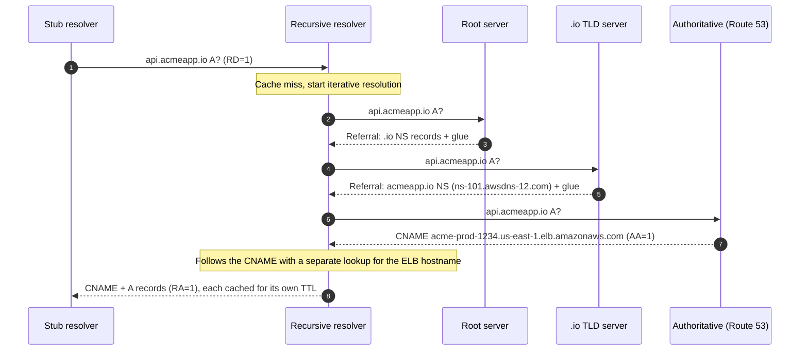
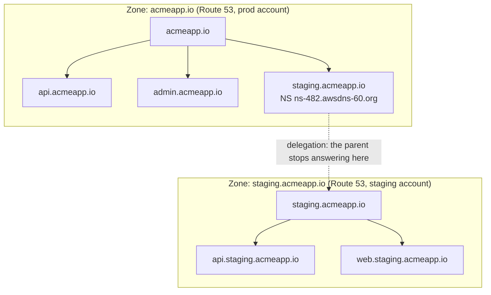
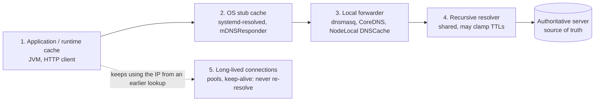
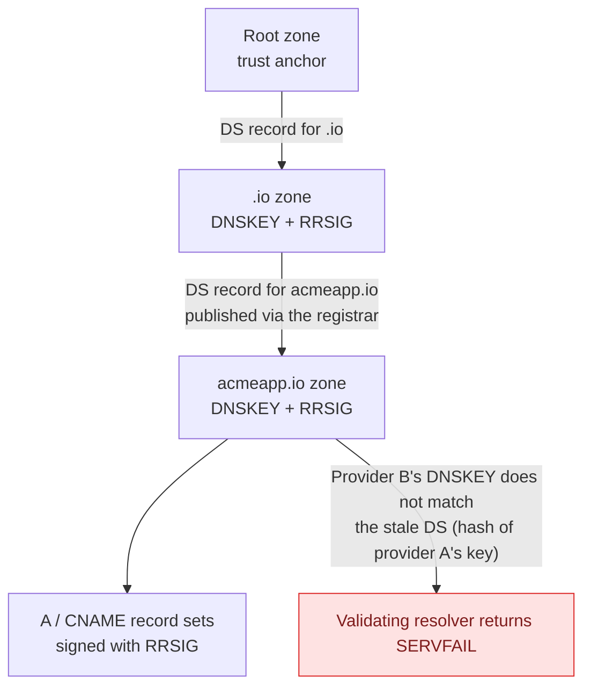
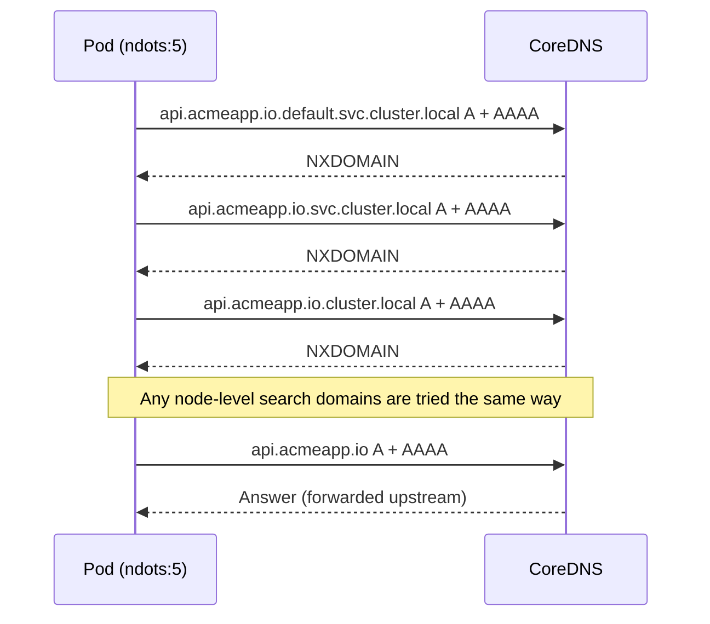
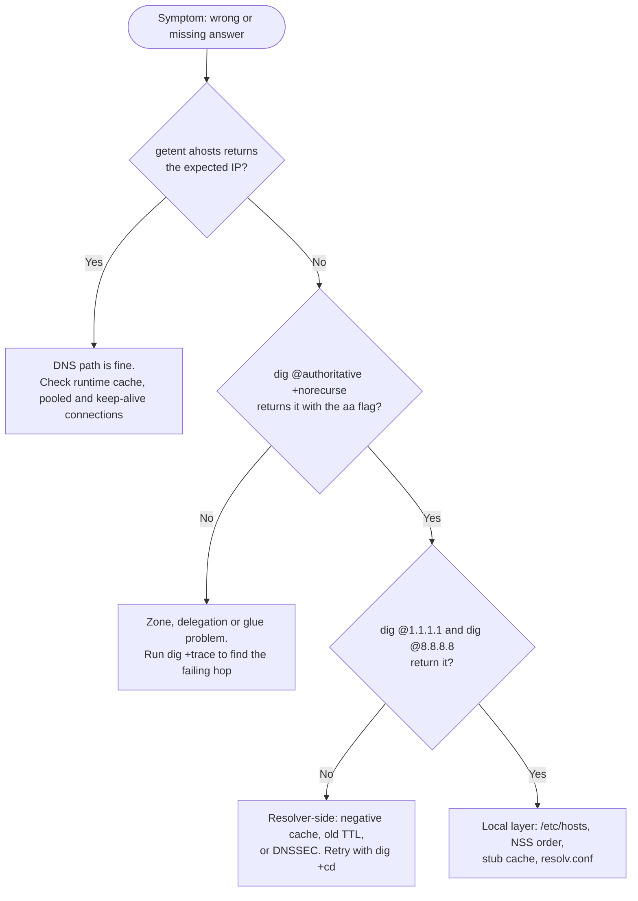

# DNS for Engineers: What Actually Happens Between `getaddrinfo()` and the First Byte

*By Rakshyak Satpathy, Backend Engineer*

You flip a record, curl the endpoint, and get `NXDOMAIN`. Ten minutes later it resolves, except from one service that still talks to the old IP. Pooled connections keep hitting a database that failed over an hour ago. A certificate refuses to issue.

Every one of these is a DNS behaviour you can predict. This article is not an introduction. It is the working model senior engineers use: how resolution really flows, where caches hide, how the protocol fails, and how to prove which layer is lying to you. The running example is a fictional SaaS, `acmeapp.io`, with `api.` on an AWS ALB, the marketing site on Vercel, `staging.` delegated to a separate Route 53 zone, and mail through Google Workspace and SendGrid.

---

## 1. The resolution path: three roles, two query modes

Three roles matter:

- **Stub resolver:** the client-side library (glibc, musl, Go's resolver, `systemd-resolved`). It sends a query with the **RD** (recursion desired) bit and expects a final answer.
- **Recursive resolver:** `1.1.1.1`, `8.8.8.8`, your VPC resolver at `.2`, CoreDNS in a cluster. It does the **iterative** work and caches results.
- **Authoritative server:** holds the zone data. It answers with the **AA** bit set and never recurses.

For a cold cache, `api.acmeapp.io A` looks like this:



Details that matter in practice:

- **Referrals carry glue.** If a zone's nameserver lives inside the zone it serves (`ns1.acmeapp.io` serving `acmeapp.io`), the parent must supply its IP as a **glue record**, or resolution would loop. Missing or stale glue at the registrar is a classic cause of "the domain resolves for some resolvers only."
- **QNAME minimisation** (RFC 9156): modern resolvers send the root only `io.`, not the full name. It is a privacy feature and occasionally exposes broken authoritative servers that mishandle minimised queries.
- **Transport:** queries default to UDP. Responses that exceed the negotiated EDNS0 buffer (commonly 1232 bytes after the 2020 DNS flag day) set the **TC** bit and the client retries over **TCP/53**. Firewalls that allow only UDP/53 produce failures that look random, since only large responses (DNSSEC, many records) break.
- **Anycast:** public resolvers and root servers announce the same IP from many locations. Your `1.1.1.1` is not one machine, and two people can get different cache states from the same address.

## 2. Zones, delegation and where the boundary really sits

A **zone** is an administrative boundary, not a naming boundary. `api.`, `admin.` and `staging.` under `acmeapp.io` are just names in one zone until an **NS record** delegates them:

```
acmeapp.io.          NS   ns-101.awsdns-12.com.     ; parent zone's own NS set
staging.acmeapp.io.  NS   ns-482.awsdns-60.org.     ; delegation: a different zone starts here
```



Once delegated, the parent no longer answers for anything at or below `staging.acmeapp.io`. Two consequences worth remembering:

- **The parent's NS set is authoritative for the delegation, not the child's own data.** If the two disagree (you changed nameservers in Route 53 but not at the registrar), resolvers follow the parent, and you get **lame delegation**: the referred server is not authoritative for the zone.
- **Delegation is how you scope blast radius.** A separate zone and AWS account for `staging.` means a bad Terraform apply cannot touch production records.

Always run at least two nameservers on independent infrastructure. Route 53 hands out four per hosted zone for this reason.

## 3. Record semantics that bite

```
acmeapp.io.                     A      76.76.21.21
www.acmeapp.io.                 CNAME  cname.vercel-dns.com.
api.acmeapp.io.                 CNAME  acme-prod-1234.us-east-1.elb.amazonaws.com.
acmeapp.io.                     MX     1 aspmx.l.google.com.
acmeapp.io.                     TXT    "v=spf1 include:_spf.google.com include:sendgrid.net ~all"
s1._domainkey.acmeapp.io.       CNAME  s1.domainkey.u123.wl.sendgrid.net.
_dmarc.acmeapp.io.              TXT    "v=DMARC1; p=quarantine; rua=mailto:dmarc@acmeapp.io"
acmeapp.io.                     CAA    0 issue "letsencrypt.org"
```

- **CNAME is name aliasing at the DNS layer, not an HTTP redirect.** The client keeps `Host: www.acmeapp.io` and the same SNI. That is precisely how a multi-tenant platform like Vercel routes your request to your project.
- **A CNAME must be the only record at its name.** The apex always carries SOA and NS, so a real CNAME there is illegal. Providers work around it with **CNAME flattening / ALIAS / ANAME**: the authoritative server resolves the target itself and returns synthesized A/AAAA records. Route 53's Alias records do this for AWS resources.
- **Prefer CNAME (or Alias) to load balancers, never pinned IPs.** ALB addresses change as it scales, and its DNS record carries a 60-second TTL to make that safe. An A record you copied from `dig` is a delayed incident.
- **SPF has a hard limit of 10 DNS-querying mechanisms** (`include`, `a`, `mx`, `redirect`...), counted recursively. Chain Google, SendGrid and a CRM, exceed 10, and receivers return `permerror`, so your mail fails authentication while every record looks fine. Flatten or trim.
- **DKIM and DMARC live at fixed labels** (`<selector>._domainkey`, `_dmarc`). Provider setup wizards rely on you creating them exactly.
- **CAA is enforced by CAs at issuance time.** If your CAA set does not include the CA, issuance fails, and the CA's error will say so. CAA also inherits down the tree, so a parent-level CAA affects subdomains.
- **SRV and HTTPS/SVCB records** can carry port and protocol parameters, but browsers ignore SRV for HTTP. For plain web traffic, DNS still tells you the *host* and nothing about the port.

## 4. Caching: five layers, each with its own rules

A single TTL is a simplification. A lookup can be cached in:

1. The **application or runtime** (JVM, custom HTTP client)
2. The **OS stub cache** (`systemd-resolved`, macOS `mDNSResponder`)
3. A **local forwarder** (dnsmasq, CoreDNS, NodeLocal DNSCache)
4. The **recursive resolver** (shared, and sometimes clamps TTLs)
5. **Long-lived connections**, which never re-resolve at all



A change at the authoritative server reaches you only after every layer between it and your process has expired or been bypassed.

Facts to internalise:

- **Cached TTLs count down.** Query a warm resolver twice and the TTL falls. That is how you tell a cached answer from a fresh one.
- **Negative answers are cached** (RFC 2308) for `min(SOA TTL, SOA MINIMUM)`. A deploy script that resolves a name before the record exists poisons that resolver for the negative TTL, which is why one public resolver returns `NXDOMAIN` while another has the record.
- **"Propagation" is cache expiry.** Nothing is pushed. If the old TTL was 3600, worst-case staleness is roughly 3600 seconds after your change, regardless of when you made it. **Lower the TTL before the change, not after.**
- **Runtimes differ.** Java's `InetAddress` cache defaults to 30 seconds without a security manager and **forever with one** (`networkaddress.cache.ttl`). Node's `dns.lookup()` calls `getaddrinfo` on the libuv threadpool (default size 4) with no caching, so slow DNS can starve `fs` and `crypto` calls, while `dns.resolve*()` uses c-ares and ignores `/etc/hosts`. Go's default resolver does not cache either.
- **Connection pools outlive DNS.** RDS and Aurora failover works by repointing a DNS record (Aurora's cluster endpoint uses a 5-second TTL). Long-lived pooled connections and HTTP keep-alives never re-resolve, so they keep talking to the demoted node. The DNS flip took seconds. Your connection lifetime and runtime cache decided the outage length. Set max connection lifetime, and configure JVM DNS TTL explicitly.
- **Not all resolvers honour low TTLs.** Some clamp minimums. Treat TTL as a request, not a guarantee.

## 5. DNS as a traffic-management layer, with its limits

- **Round robin** (multiple A records): order rotates, but nothing is health-aware. A dead IP stays in rotation until you remove it, and clients relying on Happy Eyeballs (RFC 8305) may mask it partially.
- **Weighted, latency and geo routing** (Route 53, Cloudflare) choose the answer on the authoritative side. Geo and latency decisions use the resolver's IP, or the client subnet via **EDNS Client Subnet** when supported, so users behind a distant public resolver can be mis-routed.
- **Health-checked failover** removes unhealthy targets from answers, but recovery time is bounded below by TTL plus resolver behaviour. DNS failover measures in tens of seconds to minutes, not milliseconds. If you need faster, put an anycast or L4/L7 load balancer in front and use DNS only to reach it.

## 6. DNSSEC: the chain of trust, and the failure everyone hits once

DNSSEC signs record sets (**RRSIG**) with keys published as **DNSKEY**. The parent zone holds a **DS** record, a hash of the child's key-signing key, and that anchors trust upward to the root. A validating resolver sets the **AD** bit only when the whole chain verifies.



The classic incident: you move DNS hosting from provider A to provider B, but the **DS record at the registrar still references provider A's key**. Validating resolvers (Google, Cloudflare, most ISPs) return **`SERVFAIL`**; non-validating ones resolve fine. Half your users are down, and `dig` from your laptop may look healthy depending on the resolver. Fix: remove or rotate the DS **before** moving nameservers.

## 7. Containers and Kubernetes: same protocol, harsher defaults

- **Docker** runs an embedded resolver at `127.0.0.11` for user-defined networks, which is why service names resolve inside Compose but not on the default bridge.
- **Kubernetes** pods get `search default.svc.cluster.local svc.cluster.local cluster.local` and **`ndots:5`**. Any name with fewer than five dots is tried against the search list *first*, each attempt issuing both A and AAAA. So `api.acmeapp.io` (two dots) can fire around a dozen queries at CoreDNS before the real name resolves. Mitigations: fully-qualified names with a trailing dot (`api.acmeapp.io.`), lowering `ndots` via `dnsConfig`, and NodeLocal DNSCache.
- **Alpine's musl resolver** differs from glibc: it queries configured nameservers in parallel rather than sequentially, and lacked TCP fallback before musl 1.2.4. "Works on Debian, flaky on Alpine" is often this.

Here is what `ndots:5` does to a single external lookup from a pod:



## 8. A debugging toolkit that isolates the layer

The core discipline: **`dig` tells you what DNS says. Your application sees what NSS, the stub cache and its runtime say.** They are not the same question. Work outside-in or inside-out, but always in a fixed order:



```bash
# What does the app-facing path return? (honors /etc/hosts, nsswitch.conf, the stub cache)
getent ahosts api.acmeapp.io

# Clean answer only, from a specific resolver
dig @1.1.1.1 api.acmeapp.io +noall +answer

# Cached or fresh? Run twice and watch the TTL count down.
dig @8.8.8.8 api.acmeapp.io +noall +answer

# Ask the authoritative server directly. Expect the aa flag, no cache in the way.
dig api.acmeapp.io @ns-101.awsdns-12.com +norecurse

# Iterative walk from the root, showing every referral and glue
dig +trace api.acmeapp.io

# DNSSEC validation, and whether the resolver validated (ad flag)
dig acmeapp.io +dnssec
delv acmeapp.io +vtrace

# What is your machine really using upstream?
resolvectl status
resolvectl query api.acmeapp.io

# Watch the wire: retries, TC bits, NXDOMAIN vs SERVFAIL
sudo tcpdump -ni any port 53

# Clear the local layer
resolvectl flush-caches                                       # systemd-resolved
sudo dscacheutil -flushcache && sudo killall -HUP mDNSResponder   # macOS
```

Read the header flags: `aa` means the answer came straight from an authoritative server, `ra` that recursion was available, `ad` that DNSSEC validated. The `+trace` output ends at the hop where the chain breaks: a stall at the TLD points to registrar NS or glue, a missing record at the last hop points to your zone.

## 9. Failure modes: symptom to layer

- **Resolves on one public resolver, `NXDOMAIN` on another:** negative caching. Compare SOA MINIMUM and wait, or query the authoritative server directly.
- **`SERVFAIL` on validating resolvers only:** DNSSEC chain broken (stale DS). Confirm with `dig +cd` (checking disabled): if it now answers, validation is the cause.
- **Intermittent timeouts on large responses:** UDP/TCP fragmentation or blocked TCP/53.
- **`dig` correct, application wrong:** `/etc/hosts`, NSS order, stub cache, or runtime cache. Compare `getent ahosts`.
- **One service stuck on the old IP after a cutover:** JVM TTL, pooled or keep-alive connections, or a sidecar cache.
- **Mail failing SPF with valid-looking records:** exceeded the 10-lookup limit.
- **Certificate issuance failing:** CAA missing the CA, or the ACME DNS-01 TXT not yet visible on the authoritative servers.
- **Vercel/Netlify "invalid configuration":** wrong record type at the apex (needs A/ALIAS, not CNAME), or wrong target.
- **Slow first request in-cluster:** `ndots:5` search-list amplification.

## 10. Design rules worth keeping

1. **Treat TTL as part of your deploy plan.** Lower ahead of change, restore after.
2. **Point at services by name (CNAME/Alias), never by copied IPs.**
3. **Bound connection lifetime and set runtime DNS TTLs explicitly**, or DNS-based failover will not fail over for you.
4. **Never move DNS hosting without checking the DS record first.**
5. **Split responsibilities:** separate zones per environment, at least two independent nameservers, and know who your registrar is versus who hosts DNS.
6. **Verify at the authoritative server first, then at recursive resolvers, then in the application.** That order isolates the layer.
7. **Use managed DNS** unless you have a concrete reason to operate your own authoritative infrastructure.

---

DNS is a distributed, cached, eventually consistent database with a hierarchical write path and no push mechanism. Reason about it in those terms, and most "mysterious" incidents become straightforward ones.

*What DNS failure has cost you the most time? Share it in the comments, or tell me what to dissect next.*

*Rakshyak Satpathy writes about backend engineering, system design and API architecture. More at [rakshyak.dev](https://rakshyak.dev).*
