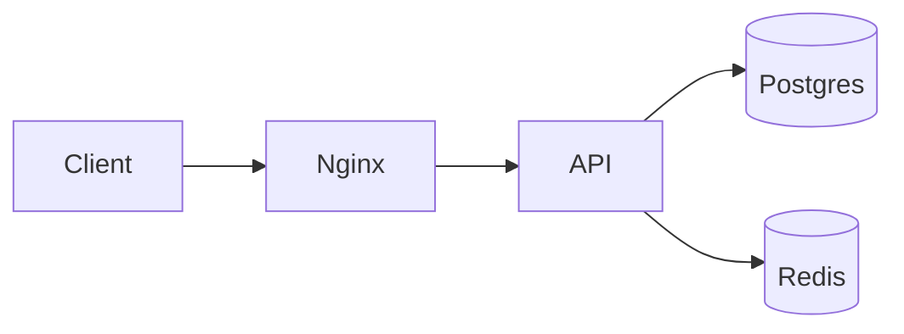
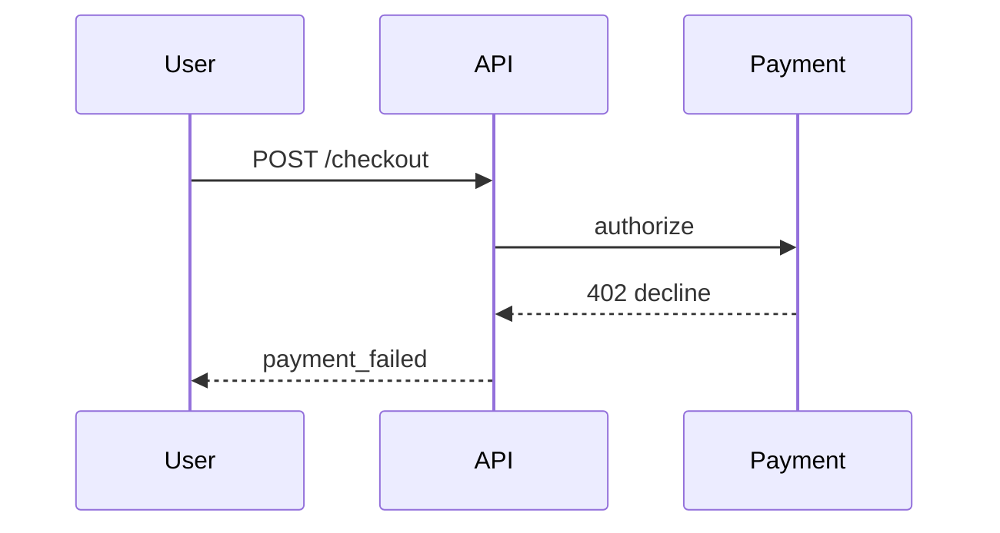
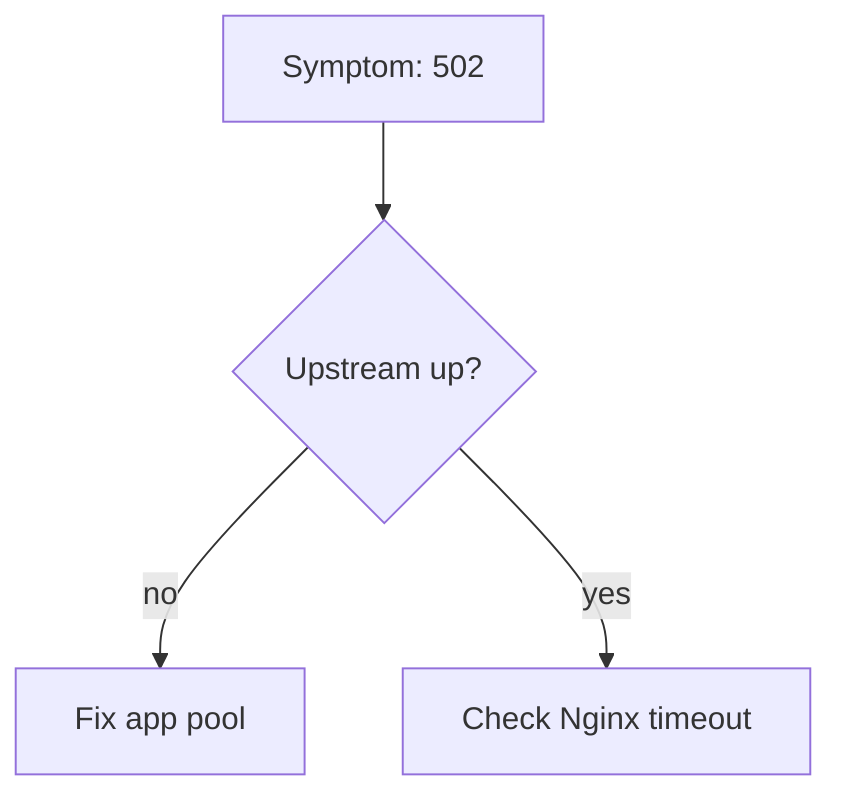

[[Descriptive]] [[README]] [[staff engineer]]

# Mermaid (DSL)

> Text-to-diagram DSL for design docs and runbooks — great for **version-controlled architecture**; know rendering and maintenance limits.

---

## Mental model

```txt
Markdown note → ```mermaid block → renderer (Obsidian/GitHub/GitLab) → SVG
```

**Strength:** diffs are readable; authors stay in IDE; diagrams update with code reviews.

**Weakness:** layout is automatic — complex graphs become spaghetti; no precise pixel control; renderer/version drift.

**Common diagram types:**

| Type | Use in SE docs |
|------|----------------|
| `flowchart` | Request paths, decision trees, incident flow |
| `sequenceDiagram` | RPC/message timing, auth handshakes |
| `classDiagram` | Domain model sketch (not codegen) |
| `erDiagram` | Schema relationships |
| `stateDiagram-v2` | Order/job state machines |
| `C4Context` (plugin) | System context (if supported) |

---

## Standard config / commands

### Flowchart (service triage)



### Sequence (debug narrative)



### Obsidian

```markdown

```

Enable **Mermaid** in Settings → Core plugins (or Community).

### GitHub / GitLab

Fenced block with language `mermaid` renders natively in MD files and PR descriptions.

### CI validation (optional)

```bash
# @mermaid-js/mermaid-cli — catch syntax errors in PR
npx @mermaid-js/mermaid-cli -i docs/arch.mmd -o /dev/null
```

### Style constraints (keep readable)

```txt
- ≤ 15 nodes per diagram; split into layers (context / container / detail)
- Left-to-right for pipelines; top-down for hierarchies
- Label edges with failure paths, not just happy path
- Use subgraph for bounded contexts
```

---

## Triage (when things break)

| Symptom | Check | Fix |
|---------|-------|-----|
| Diagram doesn't render | Renderer support | Obsidian/GitHub vs Confluence; export PNG fallback |
| Syntax error opaque | Mermaid live editor | https://mermaid.live — iterate paste back |
| Layout overlaps | Too many nodes | Split diagrams; use `direction TB/LR` |
| Different look in PR vs Obsidian | Version skew | Pin mermaid version in docs; avoid exotic syntax |
| Security concern in public repo | Diagram content | No secrets/hostnames with creds in labels |
| PDF export broken | SVG font issues | Simplify labels; export PNG from live editor |

---

## Gotchas

> [!WARNING]
> **Not a single source of truth for infra** — [[terraform]] state and live [[kubectl]] beat diagrams; link diagram to code path.

> [!WARNING]
> **Auto-layout fights you** on bidirectional graphs — manual `linkStyle` or split views.

> [!WARNING]
> **ER diagrams ≠ migration** — column types/nullable/indexes belong in SQL or ORM migrations.

> [!WARNING]
> **Stakeholders print slides** — test contrast; dark-mode Obsidian exports may wash out.

---

## When NOT to use

- **Precise network topology with IP/rack** — draw.io, Lucid, or IaC diagram generators.
- **Real-time monitoring** — dashboards (Grafana), not static Mermaid.
- **UML for codegen** — use OpenAPI/Protobuf/PlantUML with tooling if binding to code.

---

## Related

[[INDEX]] · [[NOTES_STANDARD]] · [[Configuration]] · [[Terraform workflow]] · [[gRPC]] · [[marketplace app]]
