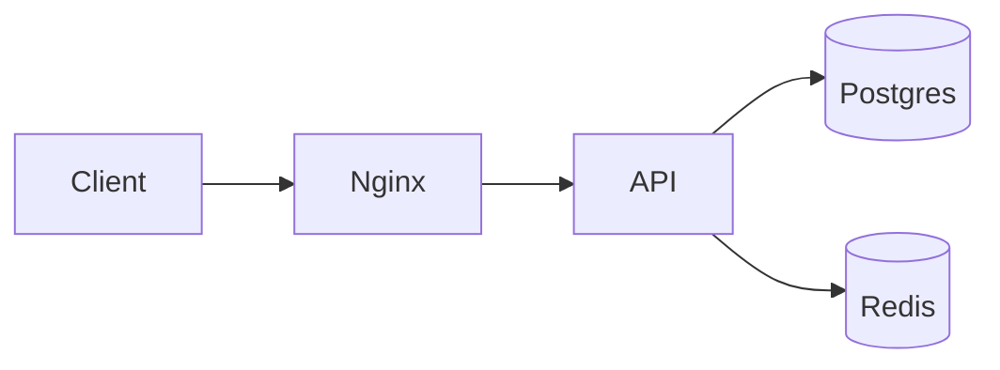
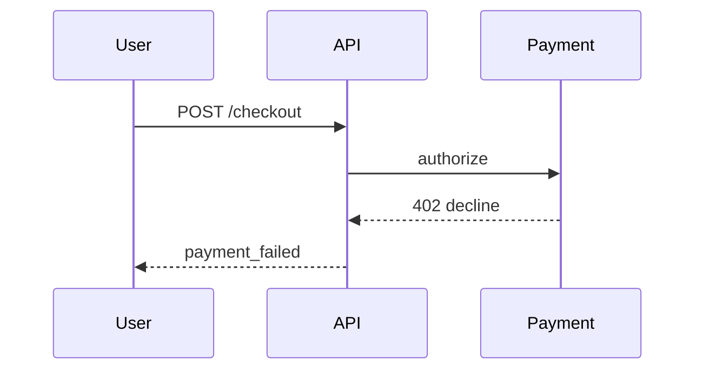

[[Descriptive]] [[README]] [[staff engineer]] [[INDEX]] [[Configuration]] [[Terraform workflow]] [[gRPC]] [[marketplace application]]

# Mermaid (DSL)

> Text-to-diagram DSL for design docs and runbooks — great for **version-controlled architecture**; know rendering and maintenance limits.

```txt
        Mermaid (DSL) ──┬── Why it matters
               ├── Sources
               ├── Concepts
               ├── Mechanism
               ├── Pitfalls
               └── Trade-offs
```

## Why It Matters
- **Key signal:** Mermaid questions check whether you can diagram flows in docs

## Sources
- [MDN Web Docs](https://developer.mozilla.org/) — overview

## Key Concepts
```txt
- **Note:** Markdown note → ```mermaid block → renderer (Obsidian/GitHub/GitLab) → SVG
```

- **Note:** **Strength:** diffs are readable

- **Note:** **Weakness:** layout is automatic

**Common diagram types:**

| Type | Use in SE docs |
|------|----------------|
| `flowchart` | Request paths, decision trees, incident flow |
| `sequenceDiagram` | RPC/message timing, auth handshakes |
| `classDiagram` | Domain model sketch (not codegen) |
| `erDiagram` | Schema relationships |
| `stateDiagram-v2` | Order/job state machines |
| `C4Context` (plugin) | System context (if supported) |

## Technical Details
### Flowchart (service triage)


```mermaid
flowchart LR
  Client --> LB[Nginx]
  LB --> API[API]
  API --> DB[(Postgres)]
  API --> Cache[(Redis)]
```

### Sequence (debug narrative)


```mermaid
sequenceDiagram
  participant U as User
  participant A as API
  participant P as Payment
  U->>A: POST /checkout
  A->>P: authorize
  P-->>A: 402 decline
  A-->>U: payment_failed
```

### Obsidian

```markdown
```mermaid
- graph TD A[Symptom: 502] --> B{Upstream up?} B -->|no| C[Fix application pool…

```
```

- Enable **Mermaid** in Settings → Core plugins (or Community).

### GitHub / GitLab

- Fenced block with language `mermaid` renders natively in MD files and PR desc…

### CI validation (optional)

```bash
# @mermaid-js/mermaid-cli — catch syntax errors in PR
npx @mermaid-js/mermaid-cli -i docs/arch.mmd -o /dev/null
```

### Style constraints (keep readable)

```txt
- ≤ 15 nodes per diagram; split into layers (context / container / detail)
- Left-to-right for pipelines; top-down for hierarchies
- Label edges with failure paths, not just happy path
- Use subgraph for bounded contexts
```

## Mistakes to Avoid
> [!WARNING]
> **Not a single source of truth for infra** — [[terraform]] state and live [[kubectl]] beat diagrams; link diagram to code path.

> [!WARNING]
> **Auto-layout fights you** on bidirectional graphs — manual `linkStyle` or split views.

> [!WARNING]
> **ER diagrams ≠ migration** — column types/nullable/indexes belong in SQL or ORM migrations.

> [!WARNING]
> **Stakeholders print slides** — test contrast; dark-mode Obsidian exports may wash out.

| Symptom | Check | Fix |
|---------|-------|-----|
| Diagram doesn't render | Renderer support | Obsidian/GitHub vs Confluence; export PNG fallback |
| Syntax error opaque | Mermaid live editor | https://mermaid.live — iterate paste back |
| Layout overlaps | Too many nodes | Split diagrams; use `direction TB/LR` |
| Different look in PR vs Obsidian | Version skew | Pin mermaid version in docs; avoid exotic syntax |
| Security concern in public repo | Diagram content | No secrets/hostnames with creds in labels |
| PDF export broken | SVG font issues | Simplify labels; export PNG from live editor |

## Pros/Cons or Trade-offs
- **Precise network topology with IP/rack**
- **Real-time monitoring** — dashboards (Grafana), not static Mermaid.
- **UML for codegen**
