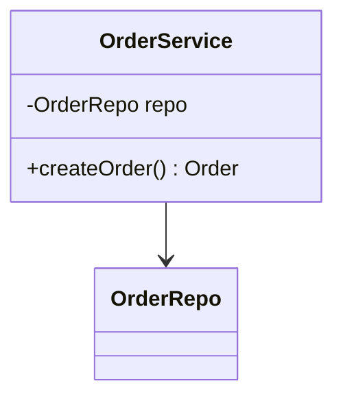
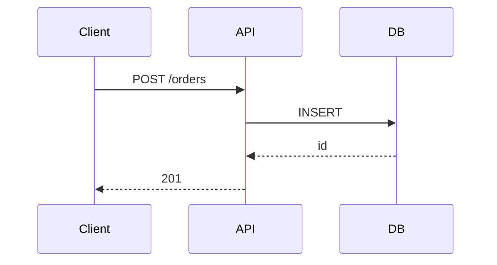

[[System Design/HES Architecture]] [[Design pattern]] [[Architectures/DSL (Domain Specific Language)]] [[Projects/marketplace application]] [[Descriptive/Mermaid (DSL)]]

# UML diagram

> Standardized boxes-and-lines notation for structure, behavior, and deployment — design reviews and onboarding — **UML 2.x subset for engineers**.

```txt
        UML diagram ──┬── Interview
               ├── Sources
               ├── Concepts
               ├── Mechanism
               ├── Pitfalls
               └── Trade-offs
```

## Interview Relevance
- **Interview probes:** UML interviews check whether you pick the right diagram for the question

## Sources
- [MDN Web Docs](https://developer.mozilla.org/) — overview

## Key Concepts
- **Note:** UML is a **visual DSL** for software design

```
┌──────────────┐         ┌──────────────┐
│   Client     │ ──────► │   API        │
└──────────────┘  HTTP   └──────┬───────┘
                                │
                                ▼
                         ┌──────────────┐
                         │   Database   │
                         └──────────────┘
```

| Diagram | Answers |
|---------|---------|
| **Class** | Types, fields, relationships |
| **Sequence** | Message order over time |
| **Component** | Modules / services |
| **Deployment** | Nodes, containers, networks |

## Technical Details
### Class diagram notation

| Symbol | Meaning |
|--------|---------|
| `+` | public attribute or operation |
| `-` | private |
| `#` | protected |
| `{static}` | underlined in tools — class-level |

```
┌─────────────────────┐
│      OrderService   │
├─────────────────────┤
│ - repo: OrderRepo   │
├─────────────────────┤
│ + createOrder(): Order │
└─────────────────────┘
```

### Relationships (pick one correctly)

| Type | Meaning | Arrow |
|------|---------|-------|
| **Association** | Uses / knows | solid line |
| **Inheritance (Generalization)** | is-a | hollow triangle ▷ |
| **Realization** | implements interface | dashed ▷ |
| **Dependency** | temporary use | dashed → |
| **Aggregation** | has-a (shared) | hollow diamond ◇ |
| **Composition** | has-a (owns lifecycle) | filled diamond ◆ |

### Mermaid in markdown (this vault)


```mermaid
classDiagram
  class OrderService {
    -OrderRepo repo
    +createOrder() Order
  }
  OrderService --> OrderRepo
```

### Sequence (debug async flows)


```mermaid
sequenceDiagram
  Client->>API: POST /orders
  API->>DB: INSERT
  DB-->>API: id
  API-->>Client: 201
```

## Mistakes to Avoid
> [!WARNING]
> **Auto-generated class diagrams from Java** expose every getter — useless noise. Curate public surface only.

- **Mistake:** **Sequence diagrams** must show **return messages** for async (d…
- **Mistake:** **Deployment diagram ≠ K8s YAML**
- **Mistake:** **State machines**

| Symptom | Check | Fix |
|---------|-------|-----|
| Diagram disagrees with code | Drift | Regenerate from code or mark "aspirational" |
| Every class on one sheet | Unreadable | Layer diagrams: domain / infra / deploy |
| Wrong arrow type | Relationship semantics | Composition vs aggregation vs dependency |
| Stakeholders confused | Too much UML | Switch to C4 or box diagram for execs |
| Tool lock-in | Proprietary format | Store Mermaid/PlantUML in git |

## Pros/Cons or Trade-offs
- Solo script < 500 LOC — comment + function names beat ceremony.
- Real-time pair programming — whiteboard sketch beats formal UML latency.
