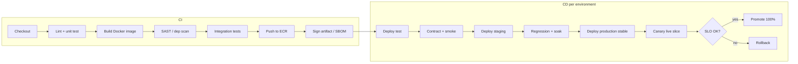

[[Release cycle]] [[Github action]] [[Jenkins]] [[spinnaker]] [[Terraform workflow]] [[ecommerce-platform-architecture]] [[ecommerce-eks-layout]] [[AWS ECR]] [[helm]]

# ecommerce cicd environments

> Five parallel environments, promotion gates, and per-stage deploy strategy for an e-commerce microservice platform on EKS — the operations contract, not tool marketing.

```txt
        ecommerce cicd env ──┬── Why it matters
               ├── Sources
               ├── Concepts
               ├── Mechanism
               ├── Pitfalls
               ├── Trade-offs
               └── Comparison
```

## Why It Matters
- **Key signal:** Reviewers probe environment topology to see if you separate accounts and s…

## Sources
- [Argo Rollouts — Canary](https://argo-rollouts.readthedocs.io/en/stable/features/canary/) — deep-dive
- [Kubernetes — Deployments](https://kubernetes.io/docs/concepts/workloads/controllers/deployment/) — overview
- [Google SRE — Release Engineering](https://sre.google/sre-book/release-engineering/) — overview

## Key Concepts
- **Parallel environments:** separate clusters/namespaces/accounts → isolation, not shared “one cluster ma…
- **Artifact promotion:** same immutable digest advances → configuration differs
- **`live` as traffic slice:** production cluster namespaces (`prod` + `live-canary`) or Argo Rollouts weigh…
- **Promotion gates:** automated tests/scans plus human change advisory before production traffic.
- **Rollback layers:** canary abort, rollout undo, Helm revision, feature flag


- **Core:** An e-commerce CI/CD environment model keeps development, test, staging, produ…

## Technical Details
```txt
dev ──► test ──► staging ──► production ──► live (traffic slice on production)
  │       │          │            │              │
  └─ fast └─ gate ───┴─ soak ─────┴─ change ─────┴─ canary / blue-green
```

### Environment topology

| Environment | AWS account | K8s target | Purpose | Typical sizing |
|-----|-------------|------------|---------|----------------|
| **dev** | `commerce-dev` | EKS `dev` / ns `dev` | Engineer integration; shared unstable | 2–3 nodes `t3.large`; 1 broker; RDS micro |
| **test** | `commerce-dev` or `commerce-test` | EKS `test` / ns `test` | CI automation, contract tests, load smoke | Same as dev; ephemeral namespaces per PR optional |
| **staging** | `commerce-staging` | EKS `staging` | Pre-production parity, migration dry-run, QA | Production-like topology at 25–40% scale |
| **production** | `commerce-prod` | EKS `prod` / ns `prod` | Stable serving (100% stable ReplicaSet) | Multi-AZ, HA Kafka, RDS Multi-AZ |
| **live** | `commerce-prod` (same) | ns `live-canary` or Rollout | Canary 5→25→100% or blue-green | Same nodes; extra canary pods only |

- **Isolation:** separate AWS accounts for production versus non-production ([[…

### Configuration and secrets per environment

| Layer | dev | test | staging | production / live |
|-------|-----|------|---------|-------------------|
| **App configuration** | `values-dev.yaml` | `values-test.yaml` | `values-staging.yaml` | `values-prod.yaml` |
| **Secrets** | Doppler / Secrets Manager `dev/*` | `test/*` | `staging/*` | `prod/*` — no shared keys |
| **PSP** | sandbox keys | sandbox | sandbox or limited live | live keys — separate webhook URLs |
| **Kafka topics** | `dev.` | `test.` | `staging.` | `prod.` — no cross-environment consumption |
| **Feature flags** | defaults on | CI overrides | QA matrix | default off until [[Release cycle]] train |

### Promotion gates

| Transition | Automated gates | Human gates |
|------------|-----------------|-------------|
| **dev → test** | Unit tests, lint, build image | — |
| **test → staging** | Integration/contract tests, SAST, container scan | — |
| **staging → production** | Regression, migration dry-run, perf smoke, no critical CVE | Change advisory / release train |
| **production → live traffic** | Health green, error rate ≤ baseline, payment SLO | Optional judgment ([[spinnaker]] pattern) |

### CI/CD pipeline



- **Artifact:** `commerce/<service>:<git-sha>` in [[AWS ECR]]

| Approach | Pros | Cons | Recommendation |
|----------|------|------|----------------|
| **Monorepo + matrix** | One workflow; shared libs versioned together | Slow if everything builds every push | Default with `paths-filter` per service |
| **Per-service workflow** | Fast feedback, clear ownership | Duplicated YAML drift | Large teams with CODEOWNERS |
| **Monorepo + N pipelines** | Balance | More files | Shared composite actions |

```yaml
# .github/workflows/service-ci.yml
on:
  push:
    branches: [main]
    paths: ['services/payment/**', 'libs/**']
jobs:
  build:
    strategy:
      matrix:
        service: [payment, refund, notification, promotions, catalog, pricing, vendor, customer, order]
    steps:
      - uses: actions/checkout@v4
      - run: ./scripts/ci/test.sh ${{ matrix.service }}
      - run: ./scripts/ci/build-push.sh ${{ matrix.service }}
```

### Deployment and rollback

| Environment | Strategy | Notes |
|-----|----------|-------|
| dev | Rolling update | `maxUnavailable: 1`; fast iteration |
| test | Rolling or Recreate | Ephemeral PR environments |
| staging | Rolling | Production manifest rehearsal |
| production | Rolling (stable RS) | PDB; readiness strict |
| live | Canary (Argo Rollouts) or blue-green | 5% → 25% → 100% ([[Release cycle]]) |

| Layer | Action | When |
|-------|--------|------|
| **Live canary** | Rollouts `abort` | SLO breach during canary |
| **K8s deployment** | `kubectl rollout undo` / Argo sync previous | Production error spike |
| **Helm** | `helm rollback <release> <revision>` | Bad chart values |
| **Feature flag** | Disable flag | Logic bug without infra rollback |
| **Kafka consumer** | Pause + skip bad offset after fix | Poison message |
| **Terraform** | Revert commit + apply previous | Infra regression |

```shell
kubectl argo rollouts get rollout payment -n prod
kubectl rollout undo deployment/catalog -n prod
helm rollback payment 42 -n prod
```

| Symptom | Check | Fix |
|---------|-------|-----|
| Staging OK, production fails | Values diff, secrets, scale | Compare Helm values; IRSA role ARNs |
| Canary red, stable green | New code only on canary | Rollouts abort; inspect payment metrics |
| Pipeline won't promote | Gate job logs | Fix scan/CVE or flaky contract test |
| Wrong environment webhook | PSP dashboard URL | Separate ingress per environment subdomain |
| Deploy stuck | PDB, insufficient nodes | Cluster autoscaler max; temporary raise max surge |

## Mistakes to Avoid
- **Mistake:** Promoting the `latest` tag
- **Mistake:** Staging without production-sized data
- **Mistake:** Canary only on one service in a tightly coupled payment/order pa…
- **Mistake:** Building five full production clones for `live`
- **Mistake:** Rolling back after a forward-only migration already applied
- **Mistake:** Copying production secrets into development or sharing Kafka top…

## Pros/Cons or Trade-offs
- **Pro:** Parallel environments plus digest promotion catch configuration and scale mismatches before customers see them.
- **Con:** Five full production clones are expensive and unnecessary — `live` is a traffic slice.
- **Con:** Canary on one service while peers stay old creates subtle cross-service bugs — coordinate release bundles or flags.

## Comparison
- vs single-namespace MVP: one workflow and one namespace until a second production deploy justifie…
- vs [[spinnaker]] multi-cloud pipelines: Argo CD + Rollouts preferred for Kubernetes-only
- vs [[Jenkins]] / [[Github action]]: either can run CI


### Use cases
- Payment and order services promote the same ECR digest from staging soak into…

- **Example:** Staging passes but production fails because IRSA role ARNs and H…
