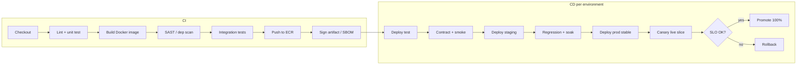

[[Release cycle]] [[Github action]] [[Jenkins]] [[spinnaker]] [[Terraform workflow]] [[ecommerce-platform-architecture]] [[ecommerce-eks-layout]] [[AWS ECR]]

# ecommerce cicd environments

> Five concurrent environments, promotion gates, and per-stage deployment strategy for the e-commerce microservice platform on EKS — **ops contract**, not tool marketing.

---

## Mental model

```txt
dev ──► test ──► staging ──► production ──► live (traffic slice on prod)
  │       │          │            │              │
  └─ fast └─ gate ───┴─ soak ─────┴─ change ─────┴─ canary / blue-green
```

All five exist **in parallel** (separate clusters or namespaces + accounts). Promotion is **artifact-based** — same immutable image digest advances; configuration differs per environment.

**`live` definition (resolved):** not a sixth infrastructure clone — **production cluster** namespaces `prod` + `live-canary` (or Argo Rollouts `canary` strategy) receiving weighted traffic after production deploy gate passes.

---

## Config & secrets per environment

| Layer | dev | test | staging | prod / live |
|-------|-----|------|---------|-------------|
| **App config** | Helm values `values-dev.yaml` | `values-test.yaml` | `values-staging.yaml` | `values-prod.yaml` |
| **Secrets** | Doppler / AWS Secrets Manager `dev/*` | `test/*` | `staging/*` | `prod/*` — no shared keys |
| **PSP** | PSP sandbox keys | sandbox | sandbox or limited live | live keys — separate webhook URLs per env |
| **Kafka topics** | prefix `dev.` | `test.` | `staging.` | `prod.` — no cross-env consumption |
| **Feature flags** | defaults on | CI overrides | QA matrix | default off until [[Release cycle]] train |

**Rules:**
- Never copy production secrets into development ([[Terraform setup]] — no keys in `.tfvars` git).
- GitHub OIDC → IAM role per environment for deploy ([[Github runner]]).
- Sealed Secrets or External Secrets Operator sync from Secrets Manager.

---

## Environment topology

| Env | AWS account | K8s target | Purpose | Typical sizing |
|-----|-------------|------------|---------|----------------|
| **dev** | `commerce-dev` | EKS `dev` / ns `dev` | Engineer integration; shared unstable | 2–3 nodes `t3.large`; 1 broker; RDS micro |
| **test** | `commerce-dev` or isolated `commerce-test` | EKS `test` / ns `test` | CI automation, contract tests, load smoke | Same as dev; ephemeral namespaces per PR optional |
| **staging** | `commerce-staging` | EKS `staging` | Pre-prod parity, migration dry-run, QA sign-off | Prod-like topology at 25–40% scale |
| **production** | `commerce-prod` | EKS `prod` / ns `prod` | Stable serving (100% stable ReplicaSet) | Multi-AZ, 3+ nodes per pool, HA Kafka, RDS Multi-AZ |
| **live** | `commerce-prod` (same) | ns `live-canary` or Rollout | Canary 5→25→100% or blue-green validation | Same nodes as prod; extra canary pods only |

**Isolation:** separate AWS accounts for production versus non-production ([[AWS STS (Security Token Service)]] boundaries). Network: VPC peering only where needed (e.g. shared observability).

**Scaling rules (HPA examples):**

| Service | dev/test | staging | prod / live |
|---------|----------|---------|-------------|
| Payment, Order | 1–2 pods, CPU 70% | 2–4 pods | 4–20 pods, QPS + queue depth |
| Catalog | 2 pods + Redis | 4 pods | 10–50 pods, cache hit ratio |
| Notification | 1 worker | 2 workers | Workers scale on Kafka consumer lag |
| Flash sale (Promotions) | manual | load test profile | Pre-warm Redis; HPA max raised via runbook |

Cluster autoscaler: `min`/`max` node pools per environment in [[ecommerce-eks-layout]] Terraform.

---

## Promotion gates (dev → test → staging → prod → live)

| Transition | Automated gates | Human gates |
|------------|-----------------|-------------|
| **dev → test** | Unit tests, lint, `go test` / `npm test`, build image | — |
| **test → staging** | Integration tests (Testcontainers), contract tests (gRPC + event schemas), SAST (CodeQL/Semgrep), container scan (Trivy/ECR scan) | — |
| **staging → prod** | Full regression suite, migration `up` on staging clone, perf smoke (k6 threshold), no critical CVE in image | Change advisory / release train ([[Release cycle]]) |
| **prod → live traffic** | Health checks green 15m, error rate ≤ baseline, payment success SLO | Optional manual judgment ([[spinnaker]] pattern) |

**Blocked promote if:**
- Schema registry compatibility check fails
- Terraform plan drift on environment workspace without approval
- [[Release cycle]] rollback criteria would have fired on staging soak

---

## CI/CD pipeline

### Stage diagram



### Per-service vs monorepo pipelines

| Approach | Pros | Cons | Recommendation |
|----------|------|------|----------------|
| **Monorepo + matrix** | One workflow; shared libs versioned together | Slow if everything builds every push | **Default:** `paths-filter` per service + matrix `service: [payment, catalog, …]` |
| **Per-service workflow** | Fast feedback, clear ownership | Duplicated YAML; drift | Large teams with CODEOWNERS per folder |
| **Monorepo + N pipelines** | Balance | More files to maintain | `/.github/workflows/payment.yml` etc. with shared composite action |

**Artifact:** `commerce/<service>:<git-sha>` in [[AWS ECR]]; deploy by digest, not floating tag.

**Tooling options:**
- CI: [[Github action]] or [[Jenkins]]
- CD: Argo CD (GitOps) + Argo Rollouts (canary) — preferred for K8s-only; [[spinnaker]] if multi-cloud pipelines already exist

### Sample GitHub Actions skeleton (monorepo matrix)

```yaml
# .github/workflows/service-ci.yml
on:
  push:
    branches: [main]
    paths: ['services/payment/**', 'libs/**']
jobs:
  build:
    strategy:
      matrix:
        service: [payment, refund, notification, promotions, catalog, pricing, vendor, customer, order]
    steps:
      - uses: actions/checkout@v4
      - run: ./scripts/ci/test.sh ${{ matrix.service }}
      - run: ./scripts/ci/build-push.sh ${{ matrix.service }}
```

---

## Deployment strategy per environment

| Env | Strategy | Notes |
|-----|----------|-------|
| dev | Rolling update | `maxUnavailable: 1`; fast iteration |
| test | Rolling or Recreate | Ephemeral PR envs: Helm install per branch |
| staging | Rolling | Prod manifest rehearsal |
| production | Rolling (stable RS) | PDB `minAvailable: 1`; readiness strict |
| live | **Canary** (Argo Rollouts) or **blue-green** | 5% → 25% → 100% over 24h ([[Release cycle]]) |

**Database migrations:** Helm pre-upgrade hook or Job; **expand/contract** only — no destructive `down` in production ([[Release cycle]] warning).

---

## Rollback strategy

| Layer | Action | When |
|-------|--------|------|
| **Live canary** | Rollouts `abort` or undo promotion | SLO breach during canary |
| **K8s deployment** | `kubectl rollout undo` / Argo CD sync previous revision | Prod error spike |
| **Helm** | `helm rollback <release> <revision>` | Bad chart values |
| **Feature flag** | Disable flag | Logic bug without infra rollback ([[Release cycle]]) |
| **Kafka consumer** | Pause consumer + skip bad offset after fix | Poison message |
| **Terraform** | Revert commit + `terraform apply` previous | Infra regression |

**Do not rollback** if forward-only migration already applied — forward fix + flag off.

**Immutable artifacts:** rollback = redeploy **previous digest** from ECR, not rebuild old branch unless source fix needed.

---

## Triage (when things break)

| Symptom | Check | Fix |
|---------|-------|-----|
| Staging OK, prod fails | Values diff, secrets, scale | Compare Helm values; IRSA role ARNs |
| Canary red, stable green | New code only on canary | Rollouts abort; inspect payment metrics |
| Pipeline won't promote | Gate job logs | Fix scan/CVE or flaky contract test |
| Wrong env webhook | PSP dashboard URL | Separate ingress per env subdomain |
| Deploy stuck | PDB, insufficient nodes | CA max; temporary raise max surge |

```shell
kubectl argo rollouts get rollout payment -n prod
kubectl rollout undo deployment/catalog -n prod
helm rollback payment 42 -n prod
```

---

## Gotchas

> [!WARNING]
> **Promoting `latest` tag** — digest drift across nodes; always pin image digest in manifest.

> [!WARNING]
> **staging without prod-sized data** — migration time estimates lie; restore prod snapshot to staging monthly.

> [!WARNING]
> **Canary only on one service** — partial fleet on new payment + old order causes subtle bugs; coordinate train by **release bundle** or feature flags.

> [!WARNING]
> **Five full prod clones for `live`** — expensive; `live` is traffic slice, not duplicate RDS.

---

## When NOT to use

- **Single service MVP** — one workflow, one namespace, skip Argo Rollouts until second production deploy.
- **No SLOs** — canary is theater; define payment success + p99 first ([[Release cycle]]).

---

## Related

[[ecommerce-platform-architecture]] · [[ecommerce-eks-layout]] · [[Release cycle]] · [[Github action]] · [[spinnaker]] · [[Terraform workflow]] · [[helm]] · [[AWS ECR]]
