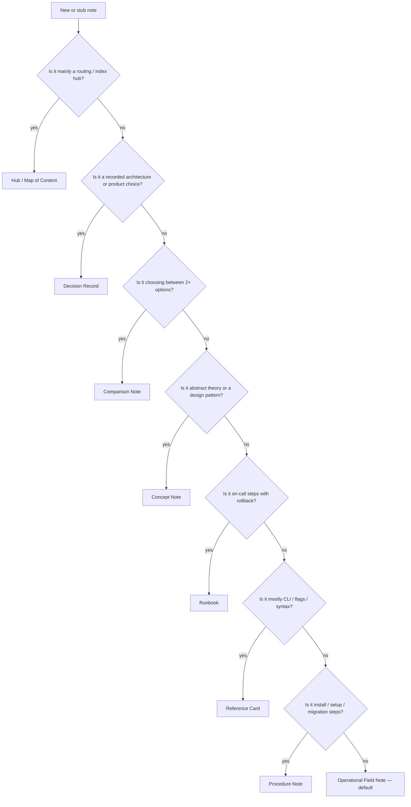

[[NOTES_STANDARD]] [[INDEX]] [[README]]

# Note-Taking Strategies

> How to pick the right note shape before you write — one strategy per note, chosen by what the reader needs under pressure.

---

## How to use this file

1. **Creating a new note** — run the decision tree below; set `<!-- note-strategy: <id> -->` on line 1 (see [Strategy IDs](#strategy-ids)).
2. **Updating an existing note** — read the note's current strategy tag (or infer from topic); expand empty sections using the matching template in [[NOTES_STANDARD]].
3. **Agents and scripts** — `scripts/apply_note_template.py` reads the strategy tag (or infers one) and applies the correct section skeleton.

All strategies share the **writing rules** in [[NOTES_STANDARD]] (full words, one-breath summaries, topic-specific triage rows).

---

## Decision tree



---

## Strategy catalog

| ID | Strategy | Reader need | Typical folders / titles |
|----|----------|-------------|---------------------------|
| `operational` | **Operational Field Note** | Operate, configure, debug a real system | Linux, Networking, Docker, Kubernetes, Nginx, Security, Protocol |
| `reference` | **Reference Card** | Look up a command, flag, or API surface fast | `* cli*`, `git command`, `redis-cli`, `kubectl` |
| `concept` | **Concept Note** | Understand an idea, pattern, or theory | Design pattern, System Design, Database semantics |
| `comparison` | **Comparison Note** | Pick the right tool or approach | `* vs *`, scaling choices, protocol selection |
| `runbook` | **Runbook** | Execute incident response step-by-step | `* error*`, cert renewal, deploy recovery |
| `procedure` | **Procedure Note** | Install, bootstrap, or migrate once | `* setup*`, `* installation*`, `* workflow*` (first-time) |
| `hub` | **Hub / Map of Content** | Route to the right child note | INDEX, domain hubs, `Design pattern` |
| `decision` | **Decision Record** | Remember why a choice was made | Architecture, platform, ADR-style notes |

---

## Strategy IDs

Set on **line 1** of any note (HTML comment — invisible in Obsidian reading view):

```html
<!-- note-strategy: operational -->
```

Valid IDs: `operational` · `reference` · `concept` · `comparison` · `runbook` · `procedure` · `hub` · `decision`

If omitted, the apply script infers from path and headings (see `scripts/apply_note_template.py`).

---

## Strategies (technique descriptions)

### Operational Field Note (`operational`)

**Technique:** Problem-oriented field documentation — mental model first, then working config, then a symptom→check→fix triage table. Derived from production postmortems and staff-engineer interview prep.

**When to use:** Anything you install, configure, operate, or debug in production (services, protocols, kernel behavior, cloud resources).

**When NOT to use:** Pure vocabulary with no operational surface; index-only hubs; one-off architecture decisions (use Decision Record).

**Section order:** Mental model → Standard config / commands → Triage → Gotchas → When NOT to use → Related

**Quality bar:** Reader answers in ~2 minutes: what is it, how to configure correctly, how to debug when it breaks, what bites in prod.

**Examples in vault:** [[gRPC]] · [[SRT (Secure Reliable Transport)]] · [[Terraform workflow]] · [[Configuration]] (Nginx)

---

### Reference Card (`reference`)

**Technique:** Cornell-style **cue + detail** — tables and one-liners for retrieval, not narrative. Minimal prose; maximal signal per line. Inspired by cheat sheets and man-page distillation.

**When to use:** CLI tools, subcommands, flags, keyboard shortcuts, SQL/psql one-liners, git invocations.

**When NOT to use:** When the reader needs failure modes and triage (upgrade to Operational).

**Section order:** Quick reference → Common commands → Options / flags → Examples → Related

**Quality bar:** Every row in the quick-reference table is copy-paste ready; flags explain *why*, not just *what*.

**Examples in vault:** [[git command]] · [[redis-cli]] · [[kubectl]] · [[ss]]

---

### Concept Note (`concept`)

**Technique:** **Feynman-style** explanation — one breath summary, then mechanism, variations, and trade-offs. Link out to operational notes for tooling.

**When to use:** Design patterns, architectural principles, database semantics (ACID, WAL), algorithms, staff-level vocabulary.

**When NOT to use:** When the note is mostly commands (use Reference) or incident steps (use Runbook).

**Section order:** Mental model → Core idea → Variations / implementations → Trade-offs → When to use / When NOT → Related

**Quality bar:** A junior engineer can restate the idea; a senior can name the failure mode and an alternative.

**Examples in vault:** [[Singleton]] · [[ACID]] · [[Clean Architecture]] · [[Design pattern]]

---

### Comparison Note (`comparison`)

**Technique:** **Decision matrix** — criteria rows, option columns, explicit selection guide. Similar to architecture decision tables without locking a single outcome.

**When to use:** "Should we use X or Y?", protocol selection, scaling model choice, build-vs-buy framing.

**When NOT to use:** When you've already decided (use Decision Record) or one option dominates (use Operational on the winner).

**Section order:** Decision context → Comparison matrix → Selection guide → Per-option gotchas → Related

**Quality bar:** Matrix columns are comparable on the same criteria; selection guide names *when* each option wins.

**Examples in vault:** [[Horizontal vs Vertical Scaling]] · comparison tables inside [[SRT (Secure Reliable Transport)]] · [[OLTP]] vs [[OLAP]] cross-links

---

### Runbook (`runbook`)

**Technique:** **Checklist-driven** incident response — trigger, preconditions, numbered steps, verification, rollback, escalation. Written for tired on-call engineers.

**When to use:** Error/recovery notes, cert renewal failure, deploy rollback, "when X breaks do Y" playbooks.

**When NOT to use:** General tool documentation (use Operational) or first-time install (use Procedure).

**Section order:** Trigger / symptoms → Preconditions → Steps → Verification → Rollback → Escalation → Related

**Quality bar:** Steps are ordered, testable, and safe to run at 3 AM; rollback is explicit.

**Examples in vault:** [[certbot error]] · [[git error]] · [[NextJS Error]] · [[vite error]]

---

### Procedure Note (`procedure`)

**Technique:** **Sequential how-to** — prerequisites, ordered steps, verification checkpoint. Like a lab procedure, not a debug guide.

**When to use:** First-time setup, installation, migration, greenfield bootstrap, CI pipeline initial configuration.

**When NOT to use:** Day-2 operations and breakage (use Operational or Runbook).

**Section order:** Prerequisites → Steps → Verification → Troubleshooting → Related

**Quality bar:** A new teammate can complete the task without asking questions; troubleshooting links to Operational notes.

**Examples in vault:** [[Terraform setup]] · [[redis installation]] · [[nvim setup]] · [[i3 Window Manager Starter Guide]]

---

### Hub / Map of Content (`hub`)

**Technique:** **Zettelkasten MOC** — no deep content; routing tables and curated links. The note is an index, not the answer.

**When to use:** Domain entry points, INDEX-style symptom maps, pattern catalogs, README-style overviews inside a folder.

**When NOT to use:** When the note itself should answer a technical question (write a leaf note instead).

**Section order:** Purpose → Routing table → Domain links → Quality examples (optional) → Related

**Quality bar:** Every link earns its row (symptom, skill, or sub-domain); no orphan stubs without a fill plan.

**Examples in vault:** [[INDEX]] · [[Design pattern]] · [[general]] · [[Database]]

---

### Decision Record (`decision`)

**Technique:** **ADR-lite** — context, decision, consequences, alternatives considered. Immutable past tense for the decision block.

**When to use:** Architecture choices, vendor selection, security model adoption, "we chose X because Y" that future you must remember.

**When NOT to use:** Reversible config tweaks; living documentation of a tool (use Operational).

**Section order:** Context → Decision → Consequences → Alternatives considered → Related

**Quality bar:** Someone joining in six months understands constraints and why rejected options failed.

**Examples in vault:** [[ecommerce-platform-architecture]] · [[Architectural backend design principles]] · [[Multi-tier and Layered Architecture]]

---

## Inferring strategy (no tag present)

| Signal | Likely strategy |
|--------|-----------------|
| File name `INDEX.md`, `README.md`, or stem matches parent folder hub | `hub` |
| Path contains `Design pattern` and note is a pattern name | `concept` |
| Stem contains `error`, `Error`, `troubleshoot` | `runbook` |
| Stem contains `setup`, `installation`, `install`, `Starter Guide` | `procedure` |
| Stem contains ` vs ` or note title is "X vs Y" | `comparison` |
| Stem ends with `cli`, `command`, `commands`, `keybindings` | `reference` |
| Stem contains `architecture`, `ADR`, `decision` | `decision` |
| Default | `operational` |

---

## Related

[[NOTES_STANDARD]] · [[INDEX]] · [[README]] · [[staff engineer]]
