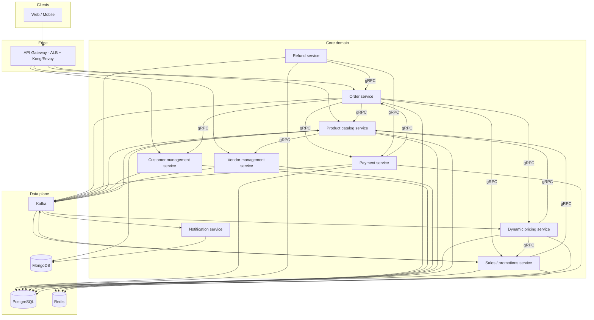

[[Projects]] [[marketplace app]] [[gRPC]] [[Messaging/Kafka/Kafka distributed event streaming]] [[Payment gateway]] [[Terraform setup]] [[ecommerce-cicd-environments]] [[ecommerce-eks-layout]]

# ecommerce platform architecture

> Reference microservice architecture for a multi-vendor e-commerce backend (Go/Node, Postgres/Mongo/Redis, Kafka, EKS) — **staff design review baseline**, not a product backlog.

---

## Index

- [[#Mental model]]
- [[#Standard config / commands]]
- [[#Scope & ambiguities]]
- [[#Service dependency diagram]]
- [[#Service catalog summary]]
- [[#Per-service design]]
- [[#Inter-service communication]]
- [[#Event schema (CloudEvents-style envelope)]]
- [[#Data consistency: saga + outbox]]
- [[#Triage (when things break)]]
- [[#Gotchas]]
- [[#When NOT to use]]
- [[#Related]]

## Mental model

```txt
Client ──► API Gateway (REST) ──► BFF (optional) ──► domain services
                              │
                    gRPC (sync, low-latency reads)
                    Kafka (async, facts + side effects)
                              │
         ┌────────────────────┼────────────────────┐
         ▼                    ▼                    ▼
   Order orchestrator   Payment / Refund    Catalog / Pricing
         │                    │                    │
         └────────────────────┴────────────────────┘
                              ▼
                    Notification (always async)
```

**Money and catalog are separate failure domains.** Never hold catalog locks while waiting on PSP. Emit facts after local commit (outbox), consume with idempotent handlers.

---

## Standard config / commands

…

## Scope & ambiguities

**In scope:** eight bounded services below plus cross-cutting platform pieces (API gateway, mesh, broker).

**Assumed companion (not one of the eight):** **Order / checkout orchestrator** — owns cart, order state machine, saga coordination. Without it, payment–refund–notification flows have no correlation id. See [[marketplace app]] for state machine; implement as a dedicated `order-service` or a thin BFF only at MVP — this note assumes **dedicated order-service**.

**`live` environment:** treated as **production traffic slice** (canary/blue-green on the prod cluster), not a fifth full stack — detail in [[ecommerce-cicd-environments]].

**Language split:** Go for payment, refund, catalog, pricing, vendor (CPU + strict typing); Node for notification (template ecosystem) and promotions (rapid rule changes). Either stack is valid per team — table below marks suggested default.

---

## Service dependency diagram



---

## Service catalog summary

| Service | Data store | Comm pattern | Scaling notes |
|---------|------------|--------------|---------------|
| Payment | PostgreSQL + Redis | REST (webhooks), gRPC (internal), Kafka out | Horizontal pods; Redis idempotency; PSP rate limits → queue captures |
| Refund | PostgreSQL | gRPC, Kafka | Lower QPS; strict audit; scale on queue depth |
| Notification | MongoDB + Redis | Kafka in, REST admin | Worker pool per channel; DLQ; scale on consumer lag |
| Sales / promotions | PostgreSQL + Redis | gRPC, Kafka | Flash sale: Redis pre-warm + partition by campaign id |
| Product catalog | PostgreSQL + Mongo + Redis | REST/gRPC, Kafka | Read-heavy: cache + CDN; write path async to search |
| Dynamic pricing | PostgreSQL + Redis | gRPC, Kafka | Compute bursts on events; cache effective price per SKU |
| Vendor management | PostgreSQL | REST/gRPC, Kafka | Moderate scale; admin-heavy |
| Customer management | PostgreSQL + Redis | REST/gRPC, Kafka | Session/profile cache; PII encryption at app layer |
| Order (companion) | PostgreSQL | gRPC, Kafka | Saga coordinator; scale with checkout QPS |

---

## Per-service design

### 1. Payment service

| Aspect | Detail |
|--------|--------|
| **Owns** | `payment_intents`, `captures`, `psp_events`, idempotency keys, reconciliation snapshots |
| **Does not own** | Order line items, refunds (delegated), customer PII beyond billing refs |
| **Public API** | REST: `POST /v1/payments/intents`, `POST /v1/payments/captures`; PSP webhook `POST /v1/webhooks/psp` |
| **Internal** | gRPC: `CreateIntent`, `Capture`, `GetPaymentStatus` |
| **Events out** | `PaymentAuthorized`, `PaymentCaptured`, `PaymentFailed` |
| **Store** | **PostgreSQL** — ACID ledger, audit; **Redis** — idempotency + webhook dedupe TTL |
| **Sync deps** | Order (gRPC): attach intent to order id; Customer (gRPC): billing customer id |
| **Async deps** | Kafka → Notification, analytics, reconciliation jobs |
| **Failure** | PSP timeout → return `processing`; retry with same idempotency key. PSP down → fail checkout with user message; do not create duplicate intents. Webhook delay → reconciliation cron compares PSP vs DB |

### 2. Refund service

| Aspect | Detail |
|--------|--------|
| **Owns** | `refund_requests`, `refund_line_items`, PSP refund ids, compensating ledger entries |
| **Public API** | REST: `POST /v1/refunds` (admin + automated dispute); gRPC internal |
| **Events out** | `RefundRequested`, `RefundIssued`, `RefundFailed` |
| **Store** | **PostgreSQL** — immutable refund audit trail (separate from payment for SOX-style separation) |
| **Sync deps** | Payment (gRPC): original capture metadata; Order (gRPC): line-level eligibility |
| **Async deps** | Kafka → Notification, Vendor (payout clawback), Order state |
| **Failure** | Partial refund failure → saga compensating step; manual review queue. PSP rejects → `RefundFailed` event; order stays `disputed` not `refunded` |

### 3. Notification service

| Aspect | Detail |
|--------|--------|
| **Owns** | Templates, delivery attempts, channel config, suppression lists |
| **Does not own** | Business facts (only renders from events) |
| **Public API** | REST admin: templates; no public send API (Kafka-only ingress for prod) |
| **Events in** | All domain `*.v1` notification-worthy events |
| **Store** | **MongoDB** — flexible template bodies; **Redis** — rate limits per user/channel |
| **Sync deps** | Customer (gRPC): resolve email/phone/push tokens |
| **Failure** | Provider 5xx → retry with backoff; DLQ after N tries; never block publishers |

### 4. Sales / promotions service

| Aspect | Detail |
|--------|--------|
| **Owns** | Campaigns, coupons, flash-sale windows, promo inventory caps, stacking rules |
| **Public API** | REST: `GET /v1/promotions/active`; gRPC: `EvaluatePromotions`, `ReservePromoSlot` |
| **Events out** | `PromotionActivated`, `FlashSaleStarted`, `PromoInventoryDepleted` |
| **Store** | **PostgreSQL** — rules + audit; **Redis** — flash counters, per-campaign locks |
| **Sync deps** | Catalog (gRPC): SKU validity; Pricing (gRPC): stack with dynamic price |
| **Failure** | Redis loss → rebuild counters from PG (degraded mode); oversell promo cap → reject at reserve |

### 5. Product catalog service

| Aspect | Detail |
|--------|--------|
| **Owns** | SKU, attributes, categories, media refs, vendor listing linkage, availability flags (not warehouse stock) |
| **Public API** | REST: product browse; gRPC: `GetProduct`, `ListByVendor`, `BatchGet` |
| **Events out** | `ProductCreated`, `ProductUpdated`, `ProductDelisted` |
| **Store** | **PostgreSQL** — source of truth; **MongoDB** — denormalized catalog blobs for fast read; **Redis** — hot SKU cache |
| **Sync deps** | Vendor (gRPC): vendor active status |
| **Async deps** | Kafka → search indexer, Pricing (refresh signals) |
| **Failure** | Cache miss → PG/Mongo fallback; stale cache TTL 30–120s acceptable for browse |

### 6. Dynamic pricing service

| Aspect | Detail |
|--------|--------|
| **Owns** | Price rules, effective price cache keys, competitor/demand inputs (not list price in catalog) |
| **Public API** | gRPC: `GetEffectivePrice`, `BatchGetEffectivePrices` |
| **Events in** | `OrderPlaced`, `InventoryLow`, competitor feed topics |
| **Events out** | `PriceChanged` |
| **Store** | **PostgreSQL** — rules history; **Redis** — materialized effective prices |
| **Sync deps** | Catalog (gRPC): base price; Promotions (gRPC): stacking |
| **Failure** | Rule engine error → return catalog base price (fail-open with metric alert) |

### 7. Vendor management service

| Aspect | Detail |
|--------|--------|
| **Owns** | Vendor accounts, KYC status, commission schedules, payout profiles, suspension |
| **Public API** | REST vendor portal + admin; gRPC internal |
| **Events out** | `VendorOnboarded`, `VendorSuspended`, `CommissionRateChanged` |
| **Store** | **PostgreSQL** |
| **Sync deps** | Customer (gRPC): linked legal entity where needed |
| **Failure** | Suspended vendor → Catalog hides listings via event (async); sync path returns `403` on write |

### 8. Customer management service

| Aspect | Detail |
|--------|--------|
| **Owns** | Profiles, addresses, preferences, loyalty tier, marketing consents |
| **Public API** | REST: `/v1/customers/me`; gRPC internal |
| **Events out** | `CustomerCreated`, `CustomerUpdated`, `ConsentChanged` |
| **Store** | **PostgreSQL** + **Redis** session-scoped profile cache |
| **Sync deps** | None critical on checkout path (gateway passes customer id) |
| **Failure** | Read degrade: cache → stale profile with `X-Data-Stale` internal header |

---

## Inter-service communication

| Pattern | Use when | Examples |
|---------|----------|----------|
| **gRPC** | Sync query/command, low latency, strong contracts | Order→Catalog batch get, Order→Payment capture |
| **REST** | Edge + webhook ingress, browser clients | API gateway routes, PSP webhooks |
| **Kafka** | Facts after commit, fan-out, replay | `PaymentCaptured` → Notification, Pricing, analytics |

**Why not REST everywhere?** Binary payloads + deadlines on internal hot paths; REST at edge for tooling and OAuth.

**Why Kafka not only SQS?** Multiple consumers per event (notification + pricing + search) with replay for new consumers; see [[Kafka distributed event streaming]].

**Service discovery:** Kubernetes **ClusterIP** + CoreDNS for gRPC targets; **AWS ALB** ingress for north-south. No hardcoded IPs. Optional **Cilium** / mesh for mTLS — [[Cilium]].

**API gateway:** Kong or Envoy Gateway on ALB — authn (JWT), rate limits, WAF ([[staff engineer]] defense-in-depth), route to services. BFF optional for mobile shape aggregation.

---

## Event schema (CloudEvents-style envelope)

All topics: `commerce.<domain>.<event>.v1` with shared envelope:

```json
{
  "specversion": "1.0",
  "id": "uuid",
  "source": "payment-service",
  "type": "commerce.payment.PaymentCaptured.v1",
  "time": "2026-08-05T12:00:00Z",
  "datacontenttype": "application/json",
  "correlationid": "order-uuid",
  "data": { }
}
```

| Event | Producer | Key consumers | `data` (minimal) |
|-------|----------|---------------|------------------|
| `OrderPlaced.v1` | Order | Payment, Promotions, Pricing, Notification | `orderId`, `customerId`, `lines[]`, `currency` |
| `PaymentAuthorized.v1` | Payment | Order, Notification | `paymentId`, `orderId`, `amount` |
| `PaymentCaptured.v1` | Payment | Order, Refund (eligibility), Notification, Vendor | `paymentId`, `orderId`, `capturedAmount` |
| `PaymentFailed.v1` | Payment | Order, Notification | `paymentId`, `orderId`, `reason` |
| `RefundRequested.v1` | Refund / Order | Notification, Vendor | `refundId`, `orderId`, `amount` |
| `RefundIssued.v1` | Refund | Order, Notification, Payment recon | `refundId`, `pspRefundId`, `amount` |
| `PromotionActivated.v1` | Promotions | Catalog cache, Notification | `campaignId`, `startsAt` |
| `FlashSaleStarted.v1` | Promotions | Pricing, CDN warm | `campaignId`, `skuIds[]` |
| `ProductUpdated.v1` | Catalog | Search, Pricing, Redis cache | `skuId`, `changedFields[]` |
| `PriceChanged.v1` | Pricing | Catalog display cache | `skuId`, `effectivePrice`, `currency` |
| `VendorSuspended.v1` | Vendor | Catalog, Promotions | `vendorId`, `reason` |
| `CustomerCreated.v1` | Customer | Notification, analytics | `customerId` |

**Schema registry:** Apicurio or Confluent — enforce backward-compatible JSON Schema / Protobuf per `type`.

---

## Data consistency: saga + outbox

### Checkout happy path (choreography + orchestrated order)

```txt
1. Order: create order (PG txn) → outbox OrderPlaced
2. Payment: consume / sync CreateIntent → PSP → outbox PaymentCaptured
3. Order: consume PaymentCaptured → state paid (idempotent)
4. Notification: consume → send email (best-effort)
```

### Payment → Refund → Notification (orchestrated saga)

Order service or Refund service as **saga leader** for refund:

```txt
RefundRequested (event or REST)
  → Refund svc: persist refund_request + outbox (same PG txn)
  → gRPC Payment: validate capture still refundable
  → PSP refund API
  → outbox RefundIssued OR RefundFailed
  → Order: consume → order state refunded / disputed
  → Notification: consume → customer email
```

**Outbox pattern** (same transaction as business row):

```sql
BEGIN;
  UPDATE orders SET status = 'paid' WHERE id = :id;
  INSERT INTO outbox (id, aggregate_id, type, payload) VALUES (...);
COMMIT;
-- relay process polls outbox → Kafka → mark published
```

See [[stateless offset handling]] and [[marketplace app]] webhook idempotency.

**Compensation:** `RefundFailed` → manual queue; do not auto-reverse order to `paid` without ops rule.

---

## Triage (when things break)

| Symptom | Check | Fix |
|---------|-------|-----|
| Paid in PSP, order pending | Payment outbox lag; webhook idempotency | Replay outbox; reconcile job; [[marketplace app]] webhook table |
| Double charge | Idempotency-Key on intent API | Redis + PG unique on key |
| Refund stuck | Refund saga step, PSP dashboard | Retry `RefundIssued`; DLQ inspection |
| Flash sale oversell | Redis promo counter vs PG | Lower TTL holds; partition Kafka by campaign |
| Stale prices at checkout | Pricing cache vs gRPC path | Short TTL; `PriceChanged` fan-out |
| Notification storm | Consumer lag, provider throttle | Scale notification workers; per-user rate limit |

---

## Gotchas

> [!WARNING]
> **Saga in Kafka consumers without idempotency** — every handler keys on `event.id` or business idempotency key.

> [!WARNING]
> **gRPC without deadlines** — cascades checkout timeouts; default 2–5s internal, 30s max with payment exception.

> [!WARNING]
> **Refund service calling Payment with shared DB** — defeats boundary; use gRPC + separate schemas only.

> [!WARNING]
> **Dynamic pricing fail-closed on browse** — kills conversion; fail-open to base price with alert.

---

## When NOT to use

- **Single-merchant Shopify-scale store** — modular monolith + [[marketplace app]] subset.
- **&lt; 100 RPS** — eight services + Kafka is operability overhead; start monolith with outbox table.
- **Strong cross-entity ACID** — use monolith DB or redesign aggregates; not 2PC across services.

---

## Related

[[marketplace app]] · [[ecommerce-cicd-environments]] · [[ecommerce-eks-layout]] · [[gRPC]] · [[Payment gateway]] · [[Kafka distributed event streaming]] · [[spinnaker]] · [[Release cycle]] · [[Multi-tier and Layered Architecture]]
