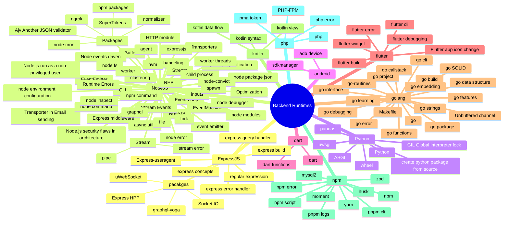

# Backend Runtimes — Topic Mind Map

> Minimal topic names for memorization. Vault folders: NodeJS, ExpressJS, npm, php, Python, golang, kotlin, dart, flutter, android.

```mermaid
mindmap
  root((Backend Runtimes))
    ExpressJS
      pacakges
        Express HPP
        Socket IO
        graphql-yoga
        uWebSocket
      Express-useragent
      express build
      express concepts
      express error handler
      express query handler
      regular expression
    NodeJS
      Packages
        Ajv Another JSON validator
        SuperTokens
        ngrok
        node-cron
        normalizer
        npm packages
      Stream
        pipe
        stream error
      Buffers
      CLI
      Error handeling
      Event Loop
      EventEmitter
      EventMachine
      Express middleware
      HTTP module
      Node events driven
      Node.js run as a non-privileged user
      Node.js security flaws in architecture
      NodeJS
      Optimization
      REPL
      Runtime Errors
      Stream
      Stream Events
      Transporter in Email sending
      Transporters
      agent
      async utils
      child process
      clustering
      event emitter
      expressjs
      file
      fork
      graphql
      inputs
      node command
      node debugger
      node environment configuration
      node error
      node fs
      node inspect
      node modules
      node package json
      node-convict
      npm command
      nvm
      open api specification
      spawn
      worker
      worker threads
    Python
      ASGI
      GIL Global interpreter lock
      Python
      create python package from source
      pandas
      uwsgi
      wheel
    android
      adb device
      sdkmanager
    dart
      dart
      dart functions
    flutter
      Flutter app icon change
      flutter build
      flutter cli
      flutter debugging
      flutter error
      flutter widget
    golang
      Makefile
      Unbuffered channel
      go
      go SOLID
      go build
      go callstack
      go cli
      go data structure
      go debugging
      go embedding
      go error
      go features
      go functions
      go interface
      go learning
      go package
      go project
      go strings
      go-routines
    kotlin
      kotlin data flow
      kotlin syntax
      kotlin view
    npm
      husk
      moment
      mysql2
      npm
      npm error
      npm script
      pnpm cli
      pnpm logs
      yarn
      zod
    php
      PHP-FPM
      php
      php error
      pma token
```
