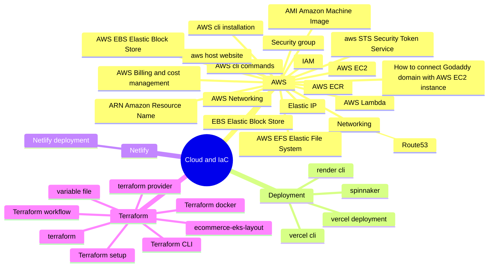

# Cloud and IaC — Topic Mind Map

> Minimal topic names for memorization. Vault folders: AWS, Terraform, Deployment, Netlify.

```mermaid
mindmap
  root((Cloud and IaC))
    AWS
      Networking
        Route53
      AMI Amazon Machine Image
      ARN Amazon Resource Name
      AWS Billing and cost management
      AWS EBS Elastic Block Store
      AWS EC2
      AWS ECR
      AWS EFS Elastic File System
      AWS Lambda
      AWS Networking
      AWS cli commands
      AWS cli installation
      EBS Elastic Block Store
      Elastic IP
      How to connect Godaddy domain with AWS EC2 instance
      IAM
      Security group
      aws STS Security Token Service
      aws host website
    Deployment
      render cli
      spinnaker
      vercel cli
      vercel deployment
    Netlify
      Netlify deployment
    Terraform
      Terraform CLI
      Terraform docker
      Terraform setup
      Terraform workflow
      ecommerce-eks-layout
      terraform
      terraform provider
      variable file
```
