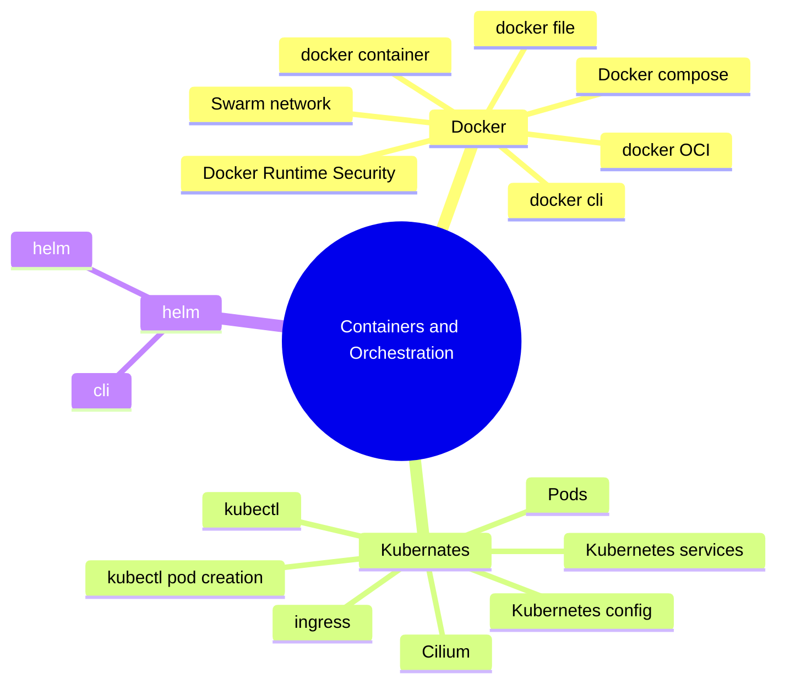

# Containers and Orchestration — Topic Mind Map

> Minimal topic names for memorization. Vault folders: Docker, Kubernates, helm.

```mermaid
mindmap
  root((Containers and Orchestration))
    Docker
      Docker Runtime Security
      Docker compose
      Swarm network
      docker OCI
      docker cli
      docker container
      docker file
    Kubernates
      Cilium
      Kubernetes config
      Kubernetes services
      Pods
      ingress
      kubectl
      kubectl pod creation
    helm
      cli
      helm
```
