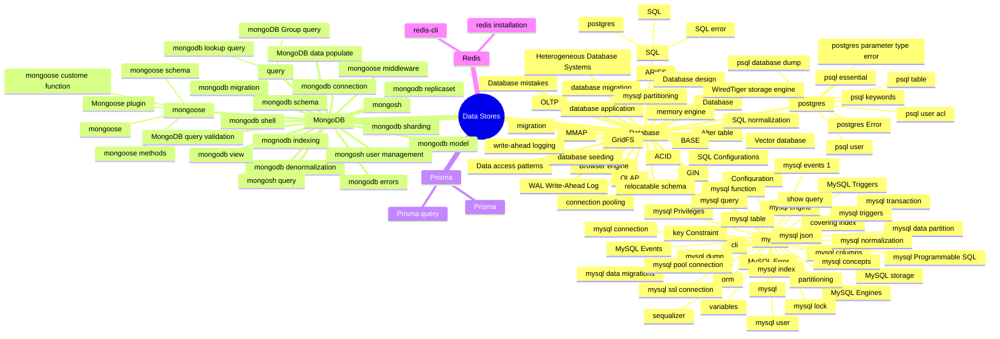

# Data Stores — Topic Mind Map

> Minimal topic names for memorization. Vault folders: Database, MongoDB, Redis, Prisma.

```mermaid
mindmap
  root((Data Stores))
    Database
      SQL
        SQL
        SQL error
        postgres
      mysql
        orm
          sequalizer
        Configuration
        MySQL Engines
        MySQL Error
        MySQL Events
        MySQL Triggers
        MySQL storage
        cli
        covering index
        key Constraint
        mysql
        mysql Privileges
        mysql Programmable SQL
        mysql columns
        mysql concepts
        mysql connection
        mysql data migrations
        mysql data partition
        mysql dump
        mysql engine
        mysql events 1
        mysql function
        mysql index
        mysql json
        mysql lock
        mysql normalization
        mysql pool connection
        mysql query
        mysql ssl connection
        mysql table
        mysql transaction
        mysql triggers
        mysql user
        partitioning
        show query
        variables
      postgres
        postgres Error
        postgres parameter type error
        psql database dump
        psql essential
        psql keywords
        psql table
        psql user
        psql user acl
      ACID
      ARIES
      Alter table
      BASE
      Browser engine
      Data access patterns
      Database
      Database design
      Database mistakes
      GIN
      GridFS
      Heterogeneous Database Systems
      MMAP
      OLAP
      OLTP
      SQL Configurations
      SQL normalization
      Vector database
      WAL Write-Ahead Log
      WiredTiger storage engine
      connection pooling
      database application
      database migration
      database seeding
      memory engine
      migration
      mysql partitioning
      relocatable schema
      write-ahead logging
    MongoDB
      mongoose
        Mongoose plugin
        mongoose
        mongoose custome function
        mongoose methods
        mongoose schema
      query
        mongoDB Group query
        mongodb lookup query
      MongoDB data populate
      MongoDB query validation
      mognodb indexing
      mongodb connection
      mongodb denormalization
      mongodb errors
      mongodb migration
      mongodb model
      mongodb replicaset
      mongodb schema
      mongodb sharding
      mongodb shell
      mongodb view
      mongoose middleware
      mongosh
      mongosh query
      mongosh user management
    Prisma
      Prisma
      Prisma query
    Redis
      redis installation
      redis-cli
```
