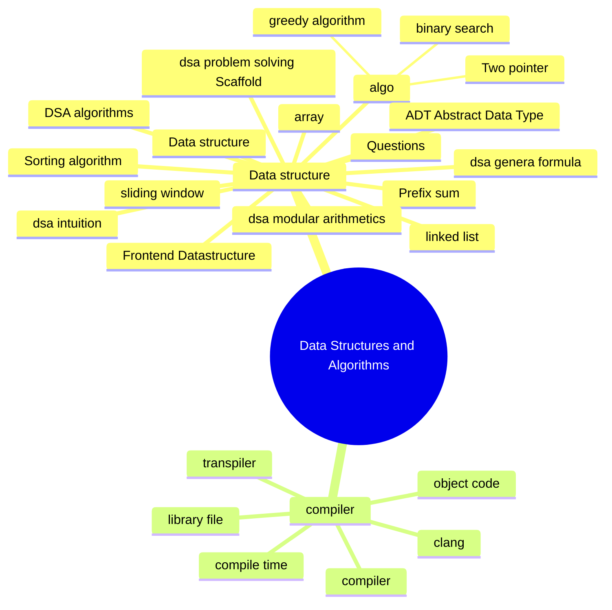

# Data Structures and Algorithms — Topic Mind Map

> Minimal topic names for memorization. Vault folders: Data structure, compiler.

```mermaid
mindmap
  root((Data Structures and Algorithms))
    Data structure
      algo
        Two pointer
        binary search
        greedy algorithm
      ADT Abstract Data Type
      DSA algorithms
      Data structure
      Frontend Datastructure
      Prefix sum
      Questions
      Sorting algorithm
      array
      dsa genera formula
      dsa intuition
      dsa modular arithmetics
      dsa problem solving Scaffold
      linked list
      sliding window
    compiler
      clang
      compile time
      compiler
      library file
      object code
      transpiler
```
