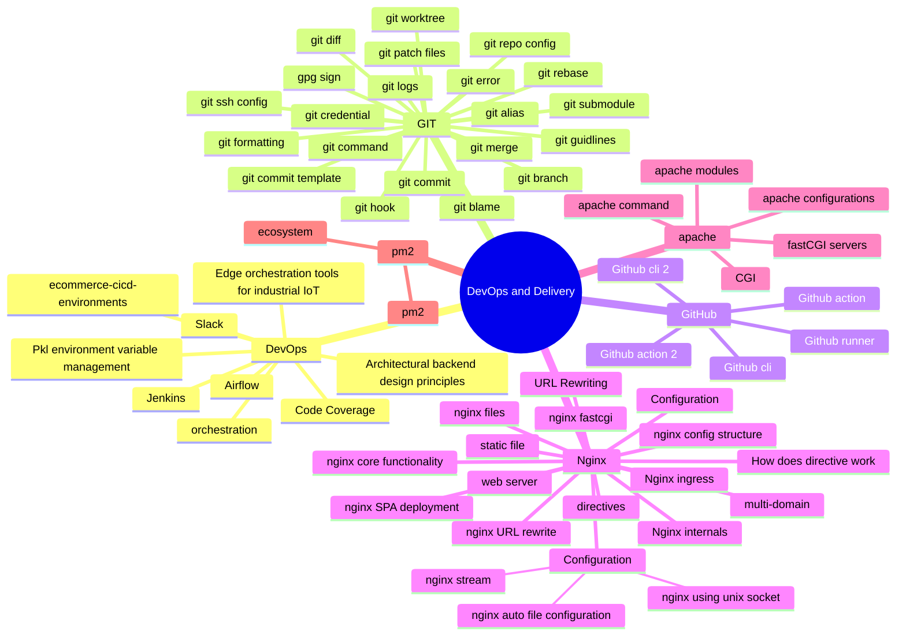

# DevOps and Delivery — Topic Mind Map

> Minimal topic names for memorization. Vault folders: DevOps, GIT, GitHub, Nginx, apache, pm2.

```mermaid
mindmap
  root((DevOps and Delivery))
    DevOps
      Airflow
      Architectural backend design principles
      Code Coverage
      Edge orchestration tools for industrial IoT
      Jenkins
      Pkl environment variable management
      Slack
      ecommerce-cicd-environments
      orchestration
    GIT
      git alias
      git blame
      git branch
      git command
      git commit
      git commit template
      git credential
      git diff
      git error
      git formatting
      git guidlines
      git hook
      git logs
      git merge
      git patch files
      git rebase
      git repo config
      git ssh config
      git submodule
      git worktree
      gpg sign
    GitHub
      Github action
      Github action 2
      Github cli
      Github cli 2
      Github runner
    Nginx
      Configuration
        nginx auto file configuration
        nginx stream
        nginx using unix socket
      Configuration
      How does directive work
      Nginx ingress
      Nginx internals
      URL Rewriting
      directives
      multi-domain
      nginx SPA deployment
      nginx URL rewrite
      nginx config structure
      nginx core functionality
      nginx fastcgi
      nginx files
      static file
      web server
    apache
      CGI
      apache command
      apache configurations
      apache modules
      fastCGI servers
    pm2
      ecosystem
      pm2
```
