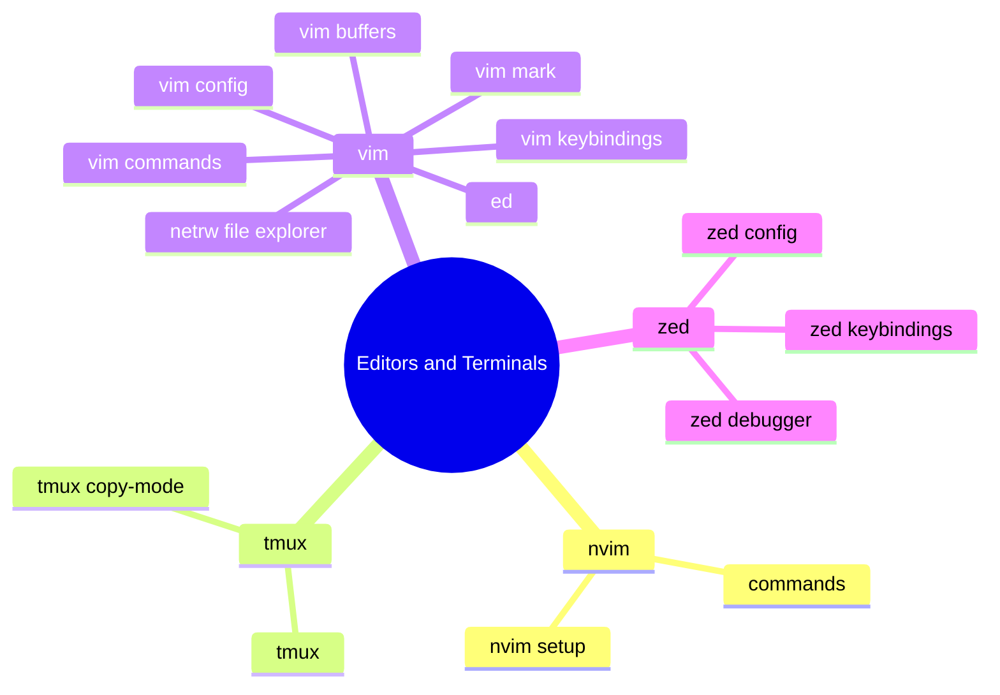

# Editors and Terminals — Topic Mind Map

> Minimal topic names for memorization. Vault folders: vim, nvim, zed, tmux.

```mermaid
mindmap
  root((Editors and Terminals))
    nvim
      commands
      nvim setup
    tmux
      tmux
      tmux copy-mode
    vim
      ed
      netrw file explorer
      vim buffers
      vim commands
      vim config
      vim keybindings
      vim mark
    zed
      zed config
      zed debugger
      zed keybindings
```
