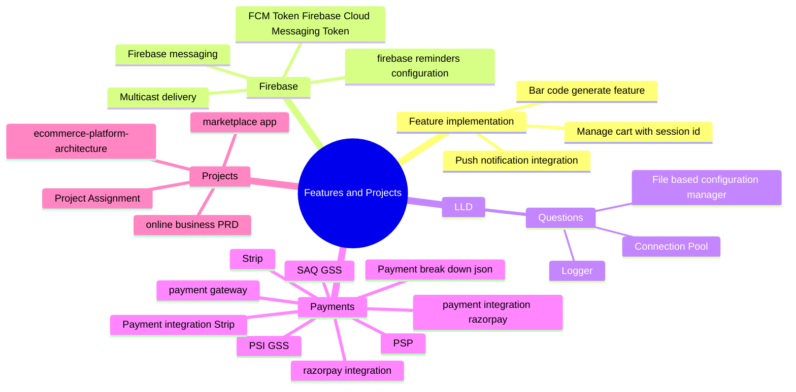

# Features and Projects — Topic Mind Map

> Minimal topic names for memorization. Vault folders: Feature implementation, LLD, Projects, Payments, Firebase.

```mermaid
mindmap
  root((Features and Projects))
    Feature implementation
      Bar code generate feature
      Manage cart with session id
      Push notification integration
    Firebase
      FCM Token Firebase Cloud Messaging Token
      Firebase messaging
      Multicast delivery
      firebase reminders configuration
    LLD
      Questions
        Connection Pool
        File based configuration manager
        Logger
    Payments
      PSI GSS
      PSP
      Payment break down json
      Payment integration Strip
      SAQ GSS
      Strip
      payment gateway
      payment integration razorpay
      razorpay integration
    Projects
      Project Assignment
      ecommerce-platform-architecture
      marketplace app
      online business PRD
```
