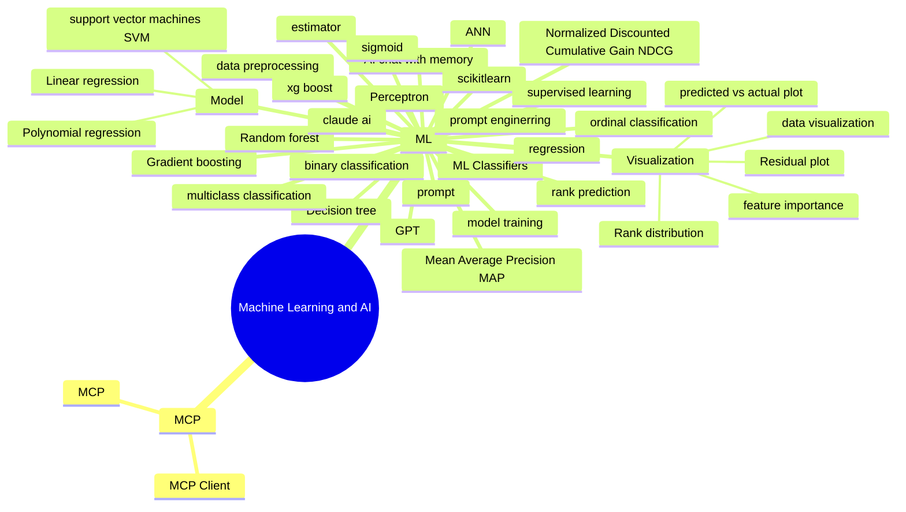

# Machine Learning and AI — Topic Mind Map

> Minimal topic names for memorization. Vault folders: ML, MCP.

```mermaid
mindmap
  root((Machine Learning and AI))
    MCP
      MCP
      MCP Client
    ML
      Model
        Linear regression
        Polynomial regression
        support vector machines SVM
      Visualization
        Rank distribution
        Residual plot
        data visualization
        feature importance
        predicted vs actual plot
      AI chat with memory
      ANN
      Decision tree
      GPT
      Gradient boosting
      ML Classifiers
      Mean Average Precision MAP
      Normalized Discounted Cumulative Gain NDCG
      Perceptron
      Random forest
      binary classification
      claude ai
      data preprocessing
      estimator
      model training
      multiclass classification
      ordinal classification
      prompt
      prompt enginerring
      rank prediction
      regression
      scikitlearn
      sigmoid
      supervised learning
      xg boost
```
