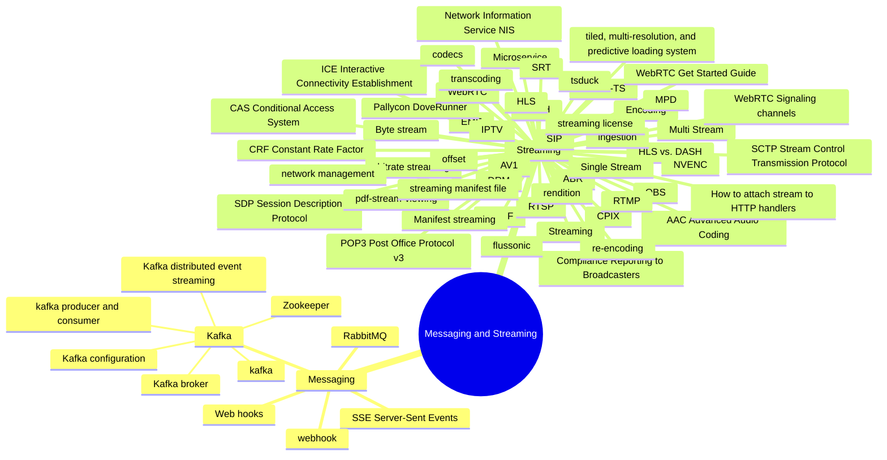

# Messaging and Streaming — Topic Mind Map

> Minimal topic names for memorization. Vault folders: Messaging, Streaming.

```mermaid
mindmap
  root((Messaging and Streaming))
    Messaging
      Kafka
        Kafka broker
        Kafka configuration
        Kafka distributed event streaming
        Zookeeper
        kafka
        kafka producer and consumer
      RabbitMQ
      SSE Server-Sent Events
      Web hooks
      webhook
    Streaming
      AAC Advanced Audio Coding
      ABR
      AV1
      Byte stream
      CAS Conditional Access System
      CMAF
      CPIX
      CRF Constant Rate Factor
      Compliance Reporting to Broadcasters
      DASH
      DRM
      EME
      Encoding
      HLS
      HLS vs. DASH
      How to attach stream to HTTP handlers
      ICE Interactive Connectivity Establishment
      IPTV
      MPD
      MPEG-TS
      Manifest streaming
      Microservice
      Multi Stream
      NVENC
      Network Information Service NIS
      OBS
      POP3 Post Office Protocol v3
      Pallycon DoveRunner
      RTMP
      RTSP
      SCTP Stream Control Transmission Protocol
      SDP Session Description Protocol
      SIP
      SRT
      Single Stream
      Streaming
      WebRTC
      WebRTC Get Started Guide
      WebRTC Signaling channels
      bitrate streaming
      codecs
      flussonic
      ingestion
      network management
      offset
      pdf-stream-viewing
      re-encoding
      rendition
      streaming license
      streaming manifest file
      tiled, multi-resolution, and predictive loading system
      transcoding
      tsduck
```
