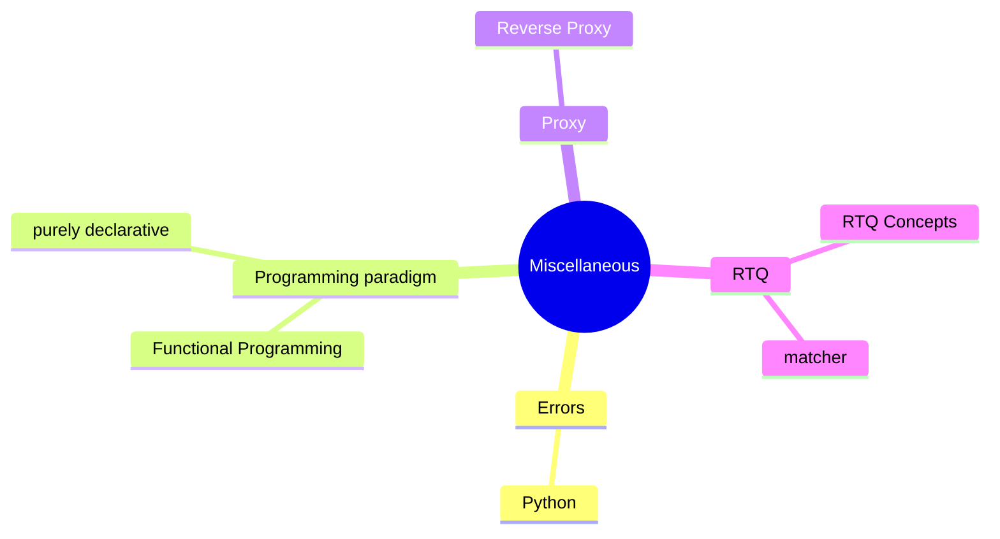

# Miscellaneous — Topic Mind Map

> Minimal topic names for memorization. Vault folders: Errors, Proxy, RTQ, Programming paradigm.

```mermaid
mindmap
  root((Miscellaneous))
    Errors
      Python
    Programming paradigm
      Functional Programming
      purely declarative
    Proxy
      Reverse Proxy
    RTQ
      RTQ Concepts
      matcher
```
