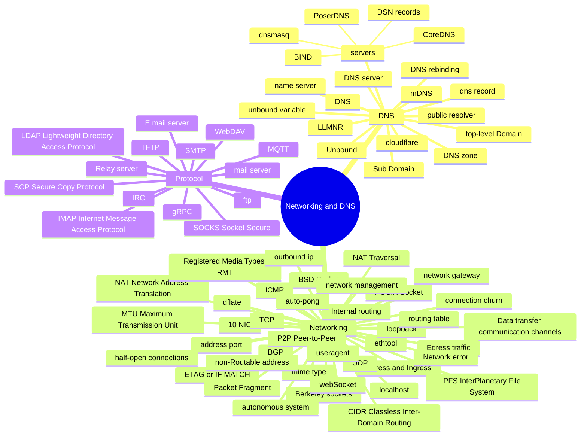

# Networking and DNS — Topic Mind Map

> Minimal topic names for memorization. Vault folders: Networking, DNS, Protocol.

```mermaid
mindmap
  root((Networking and DNS))
    DNS
      servers
        BIND
        CoreDNS
        DSN records
        PoserDNS
        dnsmasq
      DNS
      DNS rebinding
      DNS server
      DNS zone
      LLMNR
      Sub Domain
      Unbound
      cloudflare
      dns record
      mDNS
      name server
      public resolver
      top-level Domain
      unbound variable
    Networking
      10 NIC
      BGP
      BSD Socket
      Berkeley sockets
      CIDR Classless Inter-Domain Routing
      Data transfer communication channels
      ETAG or IF MATCH
      Egress and Ingress
      Egress traffic
      ICMP
      IPFS InterPlanetary File System
      Internal routing
      MTU Maximum Transmission Unit
      NAT Network Address Translation
      NAT Traversal
      Network error
      P2P Peer-to-Peer
      POSIX Socket
      Packet Fragment
      Registered Media Types RMT
      TCP
      UDP
      address port
      auto-pong
      autonomous system
      connection churn
      dflate
      ethtool
      half-open connections
      localhost
      loopback
      mime type
      network gateway
      network management
      non-Routable address
      outbound ip
      routing table
      useragent
      webSocket
    Protocol
      E mail server
      IMAP Internet Message Access Protocol
      IRC
      LDAP Lightweight Directory Access Protocol
      MQTT
      Relay server
      SCP Secure Copy Protocol
      SMTP
      SOCKS Socket Secure
      TFTP
      WebDAV
      ftp
      gRPC
      mail server
```
