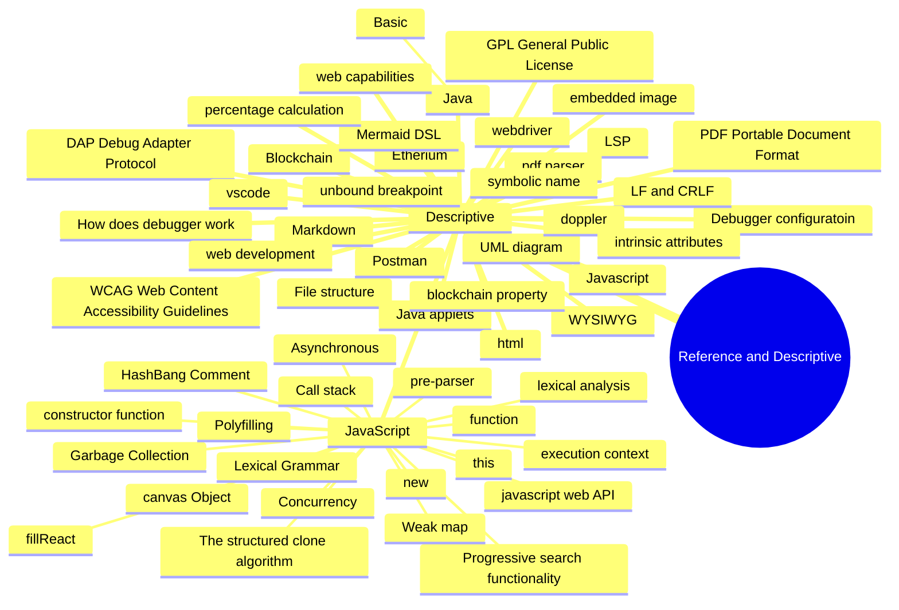

# Reference and Descriptive — Topic Mind Map

> Minimal topic names for memorization. Vault folders: Descriptive.

```mermaid
mindmap
  root((Reference and Descriptive))
    Descriptive
      Java
        Basic
      JavaScript
        canvas Object
          fillReact
        Asynchronous
        Call stack
        Concurrency
        Garbage Collection
        HashBang Comment
        Lexical Grammar
        Polyfilling
        Progressive search functionality
        The structured clone algorithm
        Weak map
        constructor function
        execution context
        function
        javascript web API
        lexical analysis
        new
        pre-parser
        this
      Blockchain
      DAP Debug Adapter Protocol
      Debugger configuratoin
      Etherium
      File structure
      GPL General Public License
      How does debugger work
      Java applets
      Javascript
      LF and CRLF
      LSP
      Markdown
      Mermaid DSL
      PDF Portable Document Format
      Postman
      UML diagram
      WCAG Web Content Accessibility Guidelines
      WYSIWYG
      blockchain property
      doppler
      embedded image
      html
      intrinsic attributes
      pdf parser
      percentage calculation
      symbolic name
      unbound breakpoint
      vscode
      web capabilities
      web development
      webdriver
```
