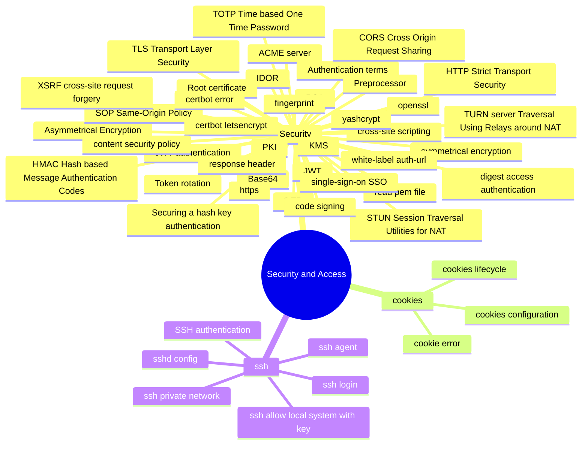

# Security and Access — Topic Mind Map

> Minimal topic names for memorization. Vault folders: Security, ssh, cookies.

```mermaid
mindmap
  root((Security and Access))
    Security
      ACME server
      Asymmetrical Encryption
      Authentication terms
      Base64
      CORS Cross Origin Request Sharing
      DER
      HMAC Hash based Message Authentication Codes
      HTTP Strict Transport Security
      IDOR
      JWT
      JWT authentication
      KMS
      PKI
      Preprocessor
      RSA
      Root certificate
      SOP Same-Origin Policy
      STUN Session Traversal Utilities for NAT
      Securing a hash key authentication
      TLS Transport Layer Security
      TOTP Time based One Time Password
      TURN server Traversal Using Relays around NAT
      Token rotation
      XSRF cross-site request forgery
      certbot letsencrypt
      certbot error
      code signing
      content security policy
      cross-site scripting
      digest access authentication
      fingerprint
      https
      openssl
      read pem file
      response header
      single-sign-on SSO
      symmetrical encryption
      white-label auth-url
      yashcrypt
    cookies
      cookie error
      cookies configuration
      cookies lifecycle
    ssh
      SSH authentication
      ssh agent
      ssh allow local system with key
      ssh login
      ssh private network
      sshd config
```
