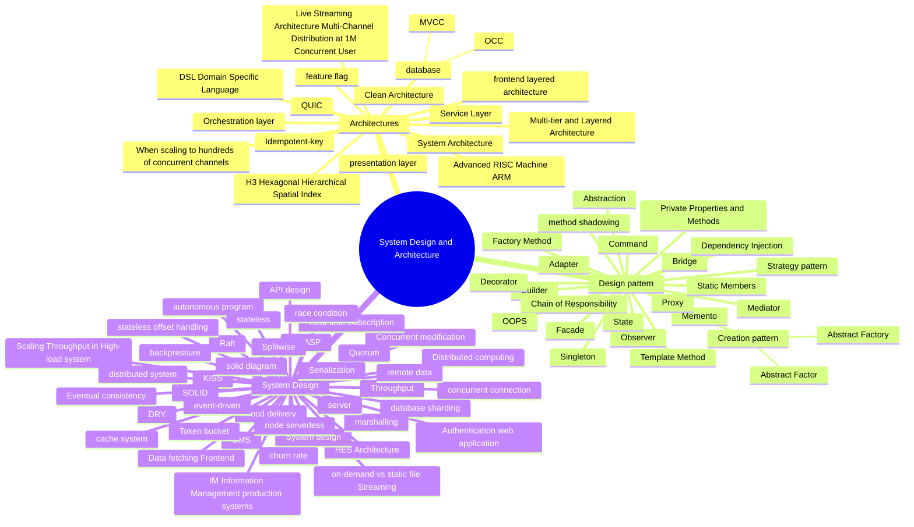

# System Design and Architecture — Topic Mind Map

> Minimal topic names for memorization. Vault folders: System Design, Architectures, Design pattern.

```mermaid
mindmap
  root((System Design and Architecture))
    Architectures
      database
        MVCC
        OCC
      Advanced RISC Machine ARM
      Clean Architecture
      DSL Domain Specific Language
      H3 Hexagonal Hierarchical Spatial Index
      Idempotent-key
      Live Streaming Architecture Multi-Channel Distribution at 1M Concurrent User
      Multi-tier and Layered Architecture
      Orchestration layer
      QUIC
      Service Layer
      System Architecture
      When scaling to hundreds of concurrent channels
      feature flag
      frontend layered architecture
      presentation layer
    Design pattern
      Creation pattern
        Abstract Factor
        Abstract Factory
      Abstraction
      Adapter
      Bridge
      Builder
      Chain of Responsibility
      Command
      Decorator
      Dependency Injection
      Facade
      Factory Method
      Mediator
      Memento
      OOPS
      Observer
      Private Properties and Methods
      Proxy
      Singleton
      State
      Static Members
      Strategy pattern
      Template Method
      method shadowing
    System Design
      API design
      Authentication web application
      CMS
      Concurrent modification
      DRY
      Data fetching Frontend
      Distributed computing
      Eventual consistency
      Food delivery
      GRASP
      HES Architecture
      IM Information Management production systems
      KISS
      Quorum
      Raft
      Real-time Subscription
      SOLID
      Scaling Throughput in High-load system
      Serialization
      Splitwise
      System design
      Throughput
      Token bucket
      autonomous program
      backpressure
      cache system
      churn rate
      concurrent connection
      database sharding
      distributed system
      event-driven
      marshalling
      node serverless
      on-demand vs static file Streaming
      race condition
      remote data
      server
      solid diagram
      stateless
      stateless offset handling
```
