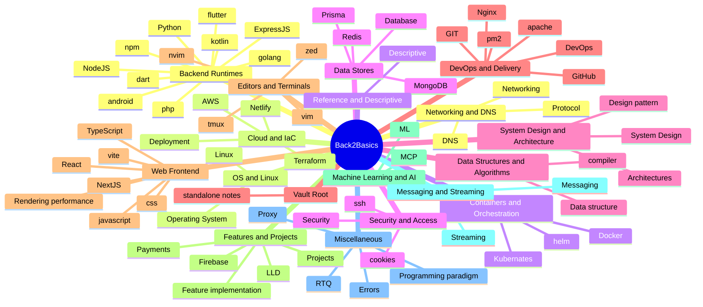

# Vault Overview — Topic Mind Map

> Top-level topic groups in this vault — use as the entry mind map.

```mermaid
mindmap
  root((Back2Basics))
    Backend Runtimes
      ExpressJS
      NodeJS
      Python
      android
      dart
      flutter
      golang
      kotlin
      npm
      php
    Cloud and IaC
      AWS
      Deployment
      Netlify
      Terraform
    Containers and Orchestration
      Docker
      Kubernates
      helm
    Data Stores
      Database
      MongoDB
      Prisma
      Redis
    Data Structures and Algorithms
      Data structure
      compiler
    DevOps and Delivery
      DevOps
      GIT
      GitHub
      Nginx
      apache
      pm2
    Editors and Terminals
      nvim
      tmux
      vim
      zed
    Features and Projects
      Feature implementation
      Firebase
      LLD
      Payments
      Projects
    Machine Learning and AI
      MCP
      ML
    Messaging and Streaming
      Messaging
      Streaming
    Miscellaneous
      Errors
      Programming paradigm
      Proxy
      RTQ
    Networking and DNS
      DNS
      Networking
      Protocol
    OS and Linux
      Linux
      Operating System
    Reference and Descriptive
      Descriptive
    Security and Access
      Security
      cookies
      ssh
    System Design and Architecture
      Architectures
      Design pattern
      System Design
    Vault Root
      standalone notes
    Web Frontend
      NextJS
      React
      Rendering performance
      TypeScript
      css
      javascript
      vite
```
