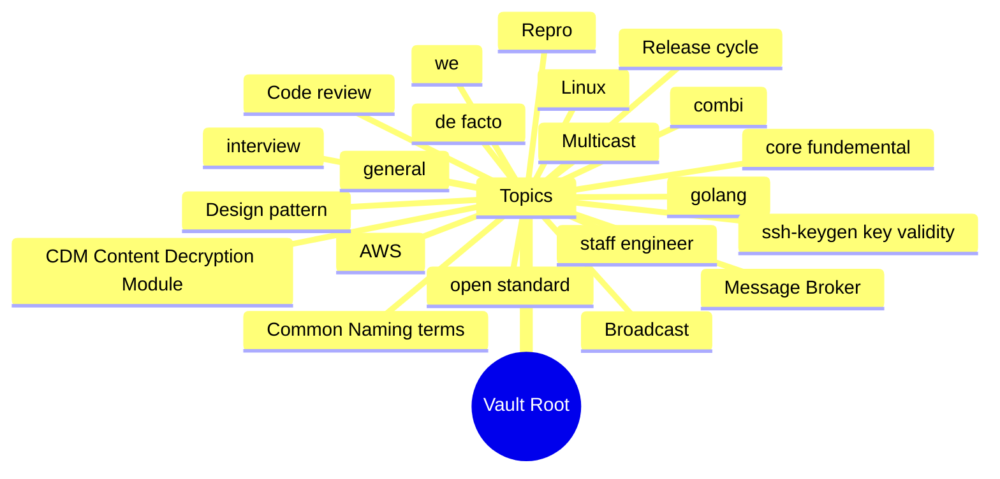

# Vault Root — Topic Mind Map

> Standalone notes at vault root (excluding navigation/meta files).

```mermaid
mindmap
  root((Vault Root))
    Topics
      AWS
      Broadcast
      CDM Content Decryption Module
      Code review
      Common Naming terms
      Design pattern
      Linux
      Message Broker
      Multicast
      Release cycle
      Repro
      combi
      core fundemental
      de facto
      general
      golang
      interview
      open standard
      ssh-keygen key validity
      staff engineer
      we
```
