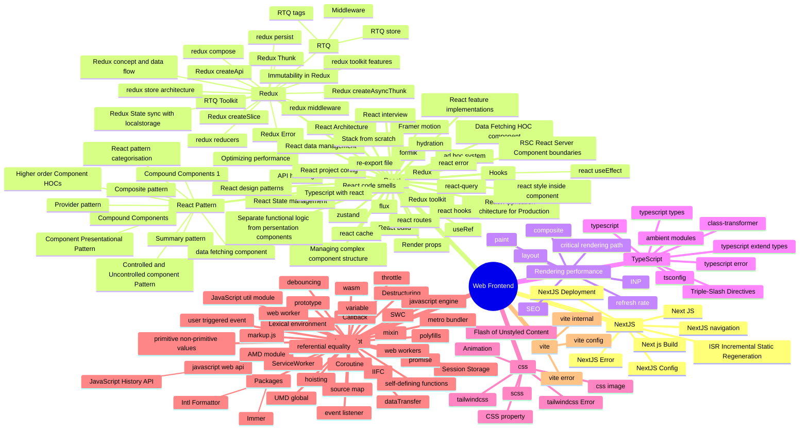

# Web Frontend — Topic Mind Map

> Minimal topic names for memorization. Vault folders: React, javascript, css, NextJS, TypeScript, vite, Rendering performance.

```mermaid
mindmap
  root((Web Frontend))
    NextJS
      ISR Incremental Static Regeneration
      Next JS
      Next js Build
      NextJS Config
      NextJS Deployment
      NextJS Error
      NextJS navigation
    React
      Hooks
        react useEffect
      React Pattern
        Component Presentational Pattern
        Composite pattern
        Compound Components
        Compound Components 1
        Controlled and Uncontrolled component Pattern
        Higher order Component HOCs
        Provider pattern
        React pattern categorisation
        Summary pattern
        data fetching component
      Redux
        RTQ
          Middleware
          RTQ store
          RTQ tags
        Immutability in Redux
        RTQ Toolkit
        Redux Error
        Redux State sync with localstorage
        Redux Thunk
        Redux concept and data flow
        Redux createApi
        Redux createAsyncThunk
        Redux createSlice
        redux compose
        redux middleware
        redux persist
        redux reducers
        redux store architecture
        redux toolkit features
      API handling
      Data Fetching HOC component
      Framer motion
      Managing complex component structure
      Optimizing performance
      RSC React Server Component boundaries
      React Application Architecture for Production
      React Architecture
      React State management
      React build
      React code smells
      React data management
      React design patterns
      React feature implementations
      React interview
      React project config
      Redux
      Redux toolkit
      Render props
      Separate functional logic from persentation components
      Stack from scratch
      Typescript with react
      ad hoc system
      flux
      formik
      hydration
      re-export file
      react cache
      react error
      react hooks
      react routes
      react style inside component
      react-query
      useRef
      zustand
    Rendering performance
      INP
      SEO
      composite
      critical rendering path
      layout
      paint
      refresh rate
    TypeScript
      Triple-Slash Directives
      ambient modules
      class-transformer
      tsconfig
      typescript
      typescript error
      typescript extend types
      typescript types
    css
      Animation
      CSS property
      Flash of Unstyled Content
      css image
      scss
      tailwindcss
      tailwindcss Error
    javascript
      Packages
        Immer
        Intl Formattor
      javascript web api
        JavaScript History API
      AMD module
      Callback
      Coroutine
      Destructuring
      IIFC
      JavaScript util module
      Lexical environment
      SWC
      ServiceWorker
      Session Storage
      UMD global
      dataTransfer
      debouncing
      event listener
      hoisting
      javascript engine
      markup.js
      metro bundler
      mixin
      polyfills
      primitive non-primitive values
      promise
      prototype
      referential equality
      self-defining functions
      source map
      throttle
      user triggered event
      variable
      wasm
      web worker
      web workers
    vite
      vite config
      vite error
      vite internal
```
